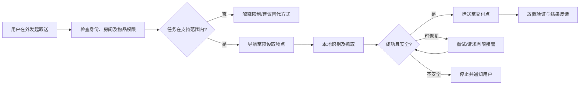
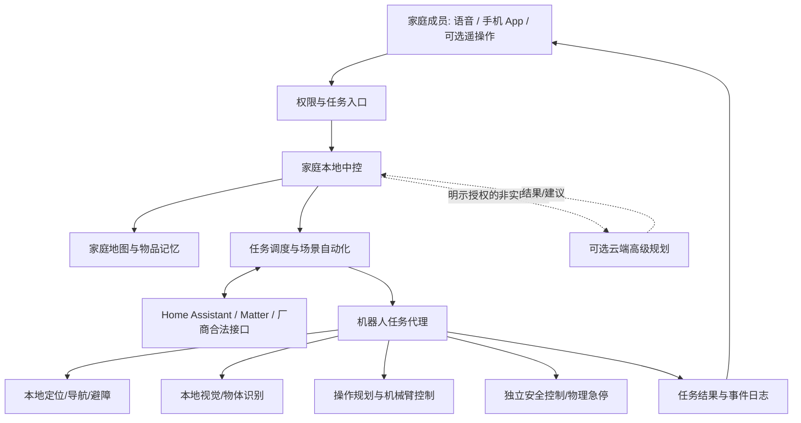
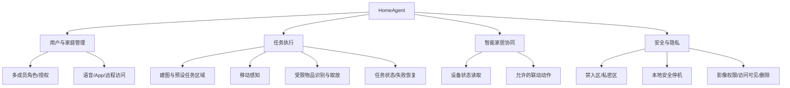
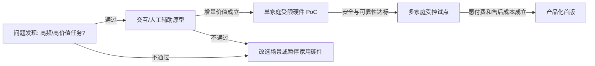

# HomeAgent｜智能家庭通用物理执行终端

> **文档类型：** 产品说明 / 市场机会与产品定义（非研发 PRD）  
> **版本：** V1.0 · 2026-10-05  
> **阶段：** 产品概念与公开资料研究完成；一手用户研究、技术 PoC 与商业验证待开展  
> **研究范围：** 家庭内可移动、可感知、具备受限物理操作能力的机器人及其与智能家居系统的协同  
> **证据约定：** `[事实]` 为附有来源的公开信息；`[假设]` 为待验证的产品判断；`[方案]` 为拟议设计；`[目标]` 为内部拟议验收门槛，并非现有能力或客户调查结果。

---

## 0. 产品概要

**一句话定位：** HomeAgent 是面向繁忙家庭的智能家居物理执行终端，通过移动感知、有限的通用操作和家庭任务调度，使现有智能家庭能够处理联网设备无法直接完成的现实事务。

**长期愿景：** 成为家庭智能系统可调用的通用物理服务节点，逐步承担取送、整理、设备操作与远程家庭事务，并以统一的权限、家庭记忆和交互入口减少日常生活的管理负担。

**近期产品命题：** 不是“任何家务都能做”，而是验证一组目前需要家庭成员亲自在场、专用智能家电又不能经济覆盖的物理任务，是否足以支撑一台有操作能力的家用机器人。

| 关键项 | 当前定义 |
|---|---|
| 优先研究用户 | 家庭成员经常同时外出、已使用智能家电、对减少事务性劳动有明确需求且有预算的家庭；双职工是招募假设，而非已证实的最佳细分市场 |
| 核心待验证价值 | 远程家庭事务的实际解决能力；日常物品管理的持续服务价值；与现有智能家居的互补性 |
| 产品形态 | 室内轮式移动底盘 + 受限操作臂 + 家庭中控/软件；不预设人形 |
| 候选首发闭环 | 在授权的单层家庭内，用户远程下达指令，机器人前往预设取物点，将受支持的轻小物品送至预设交付点，并反馈结果 |
| 主要风险 | 高频且高价值的物理任务是否存在；用户能否接受价格、任务边界、人工接管和家庭影像采集 |
| 商业判断 | **尚不具备直接量产立项依据**；应先完成问题发现、替代方案比较和实验型 MVP |

## 1. 市场与用户分析

### 1.1 市场背景与真实机会边界

现有智能家居已经能进行跨设备控制和自动化，缺口不是“市场上没有智能中控”。Home Assistant 支持 Matter 设备通过本地 Wi-Fi/Thread 控制，部分联网设备和家庭自动化可以不依赖互联网运行 [H1][H2]。真正可能尚未被充分满足的是：**针对没有联网接口、位置会变化、需要人类动作的实体物品，智能系统缺少灵活而经济的执行端。**

[事实] IFR《World Robotics 2025》统计，2024 年消费级服务机器人销量接近 **2,010 万台**，其中绝大多数属于清洁、割草等具体家务任务；这不能当作通用家庭机器人的现成市场规模 [H3]。家用通用操作处于竞争加速阶段：1X 已公开预订 NEO；LG 展示了 CLOiD 与 ThinQ 协同的家务场景；Figure 于 2026 年 9 月公开了三项家庭任务在 30 个未参与训练家庭中的测试 [H4][H5][H6]。这些进展证明需求与技术方向受到关注，**不能证明产品已具备量产级可靠性或普遍的支付意愿**。

### 1.2 优先研究人群

| 人群 | 待验证的情境 | 当前替代方案 | 可能成为购买理由的条件 | 主要阻碍 |
|---|---|---|---|---|
| 双职工、经常同时外出的家庭 | 回家前后事务集中、外出期间需要处理家中实物 | 智能家电、家政、快递柜、邻里协助 | 真实事件频繁、人工协调成本高 | 很多家务可延后处理；远程物理任务可能低频 |
| 已有较多智能家电的家庭 | 跨设备自动化有覆盖盲区 | Home Assistant、Matter、各品牌 App | 机器人能补齐“非联网物体操作”而非重复现有控制 | 生态兼容、配置复杂、原有投资较高 |
| 异地照看家人的家庭 | 希望远程在场，偶有实物协助需求 | 固定/移动摄像头、视频通话、上门服务 | 有高频、低风险、能明确界定的物理操作场景 | 高敏感隐私、照护责任及人身安全；首版不承诺医疗或救援功能 |
| 高收入科技早期用户 | 愿意尝试不成熟的机器人能力 | 其他早期家用机器人 | 愿意支付试点溢价并参与反馈 | 尝鲜意愿不能外推到主流消费者 |

**首轮 ICP（理想客户画像）假设：** 城市单层住宅、2—3 名家庭成员、经常在白天无人、可接受有限的物品与家具预设、已拥有至少两类智能家居设备。是否值得进一步限定收入、孩子/老人/宠物等因素，应由访谈而非直觉决定。

### 1.3 购买者、使用者与受影响者

- **付款与配置者：** 决定是否购置、设置家庭自动化及设备权限的成年人。
- **主要使用者：** 通过语音/App 下达日常和远程任务的家庭成员。
- **被动受影响者：** 同住成员、来访客人、家政人员以及偶尔出镜的孩子；他们的同意、禁入区和访问可见性属于产品要求，不能只征得购买者同意。
- **安装与维护参与者：** 安装服务、售后、必要时的专业远程协助人员；一旦他们可能接触家庭影像，必须单独设计授权和留痕。

## 2. 场景机会与优先级

### 2.1 场景机会池

| 场景 | 用户获得的结果 | 物理操作必要性 | 需求价值假设 | 技术/风险判断 | 产品阶段 |
|---|---|---|---|---|---|
| 授权区域远程巡查 | 不在家时确认具体环境 | 低；移动摄像头已可满足大量需求 | 作为基础能力而非独立高价卖点 | 移动成熟，隐私要求高 | 候选基础功能 |
| 预设物品远程取送 | 不在场仍能移动实物至指定交付点 | 高，但接收方/后续用途必须真实存在 | 差异化强、频率可能低 | 刚性物品较可控；难在需求闭环 | 实验型 MVP 候选 |
| 常用物品定位与归位 | 降低找东西、整理和家庭事务管理负担 | 高 | 潜在高频，但需家庭习惯与物品知识 | 物品记忆、杂乱环境、人机规则复杂 | 后续重点研究 |
| 洗衣后取出、晾晒、折叠 | 减少高频重复劳动 | 高 | 可量化省时，但专用家电替代性需比较 | 柔性物体、双手操作、复杂抓取困难 | 不进入首版 |
| 远程与快递员交接 | 用户不在家仍能完成物品交接 | 不一定；快递柜/智能门锁可替代部分需求 | 发生频率和风险高度依家庭而变 | 开门权限、门外安全、陌生人接触 | 不进入首版 |
| 家庭成员的远程互动 | 提供移动化视频与有限的物理指示 | 低—中 | 需证明超越视频通话与移动摄像头 | 隐私与对人的安全要求高 | 调研，不承诺照护 |

优先级不是上述表格中的“技术可做程度”。正式排序使用以下六项现场取得的指标：实际发生频率、单次损失/麻烦、已发生支出、现有替代方案缺陷、机器人不可替代的物理步骤、完成任务所需的安全与接管成本。

### 2.2 候选核心场景的任务闭环

**情境假设：** 白天家里无人，某名有授权的家庭成员需要将一件已知轻小物品从预设房间移动至家中约定交付位置。机器人在本地完成导航与取放，发起者在 App 中确认结果。



**重要的商业缺口：** 仅把物品从客厅搬到玄关并不一定为不在家的用户创造价值。第一轮访谈必须找出至少一种确切的下游需求（例如家中另一位已授权的成年人需要该物品）；若找不到，不能为了演示闭环而将它定义为正式量产 MVP。

## 3. 产品定位与系统边界

### 3.1 核心价值主张

**HomeAgent 不是另一台联网家电，而是接入家庭智能系统、可在可控范围内执行物理操作的服务节点。** 它通过独立的物理行动能力补充现有中控，而不是重复造一整套封闭式智能家居生态。

三层价值依次为：

1. **物理在场：** 跨房间移动，主动查看得到授权的局部环境，完成简单真实物理操作。
2. **委托执行：** 用户指定期望结果，系统处理感知、局部规划、执行及反馈；低置信度才请求有限介入。
3. **家庭事务记忆与协同：** 在用户同意下记住指定物品、任务和设备状态，与现有智能家电形成连续服务。

### 3.2 模块架构



**安全边界：** 高层模型可以建议任务，但不能绕过本地碰撞保护、力/速度限制、权限与急停；网络中断时不继续执行需要持续远程授权的动作。原始家庭影像默认仅在本地实时处理且不长期留存；远程实时查看是一个与“云端模型处理”不同的授权事项，需加密传输、明显提示及单独审计。经过脱敏的空间特征仍可能泄露家庭信息，应允许用户拒绝上传和清除相关记录。

### 3.3 功能树



## 4. 竞品与替代方案

| 产品/替代方案 | 可核实的公开能力及状态 | 对 HomeAgent 的挑战 | 待验证差异化 |
|---|---|---|---|
| **1X NEO** | 官方开放预订；标价 **20,000 美元**购买或 **499 美元/月**订阅；基础自主能力、家务管理及按计划由专业人员远程协助复杂任务，2026 年起计划美国交付 [H4] | 家用操作与远程协助组合不是空白 | 更开放的家居生态、明确的本地数据权限、聚焦更经济的任务组合；仍需实测证明 |
| **LG CLOiD** | CES 2026 家用机器人演示，轮式底座、双 7 自由度机械臂，与 ThinQ 协作，展示早餐及洗衣场景；不是已核实的大规模量产交付 [H5] | “智能家居中控 + 物理执行终端”已有大厂布局 | 跨品牌开放性、用户可配置规则；避免和成熟家电生态硬碰硬 |
| **Figure Helix 2.5 / Figure 03 路线** | 2026 年 9 月公司公布：单一预训练基础模型针对整理、折毛巾、铺床三类任务，在 30 个未见家庭测得总体零样本成功率 **56%**；为厂商实验结果，不是商品性能保证 [H6] | 泛化能力提升快，不能把家庭视觉/操作任务描述为无人研究 | 商业交付、安全及持续性服务，而不是夸大单项演示 |
| **Enabot EBO X** | 官方有 V-SLAM、4K 摄像头、自动巡航与远程通信；官方商品页标价 **999 美元**，商城活动价可能不同，部分页面显示缺货 [H7] | 纯远程巡查与沟通已有较低价替代 | 新增机械操作的用户增量价值是否足以覆盖硬件成本 |
| **Home Assistant + Matter** | 多品牌设备、本地控制及自动化 [H1][H2] | 统一控制不是新市场缺口 | 以开放接口加入成熟生态，补充物理操作能力 |
| **专用智能家电、智能锁、家政及快递柜** | 分别解决清洁、门禁、上门家务和交付等明确问题 | 对高频固定任务通常更经济、更可靠 | 仅争取这些方案之间难以覆盖的连续/非标准物理事务 |

**结论：** 目前不能以“具备远程控制”“会折衣服”或“有统一中控”作为独占卖点。市场机会必须由**同一台设备可以经济地处理若干真实高价值物理任务**来证明。

## 5. MVP 范围与产品路线

### 5.1 分清研究 MVP 与可售产品 MVP

**研究 MVP（本阶段必须做）：** 交互原型与任务流程验证，不要求生产完整机器人。对比 A 组“移动感知/远程通信”和 B 组“在 A 上增加受限取放”，测试真实任务解决能力、用户参与时长与价格敏感度。允许知情披露的 Wizard-of-Oz 人工辅助，但不得将人工演示宣称为机器人自主能力。

**候选可售 MVP（仅在研究通过后）：** 单层预设住宅；允许的房间与路径；预设取送点；少量已验证的刚性轻小物品；远程发起任务；本地自主导航与抓取；必要时有限人工介入；结果确认与异常处理。

| 范围 | P0：候选首版 | P1：验证后考虑 | 明确排除 |
|---|---|---|---|
| 物理能力 | 受限物品取放、单层导航、自动回充 | 可配置的常用物品归位、少量设备操作 | 任意物品操作、开门出户、上下楼梯、持危险物 |
| 智能能力 | 预设任务理解、局部自主执行、失败检测 | 个性化物品记忆、跨任务规划 | 无限制自主行动、无审计的“主动决策” |
| 交互 | 手机、语音、任务状态、授权访问 | VR 精细遥操作 | 以 VR 设备为必需购买条件 |
| 家居集成 | 有明确授权的选定 Matter/Home Assistant 设备 | 更多品牌及跨设备流程 | 自研替代全部家居中控协议 |
| 安全 | 急停、禁入区、接触保护、远程访问提示 | 更多预防性风险识别 | 无人监督的门外陌生人交接、医疗照护承诺 |

**PoC 工程边界建议（不是已实现指标）：** 初期仅选择 3—5 类刚性物品、单件不超过 0.5 kg、固定高度的取放点；待底盘稳定性、夹持力和安全验证后再修订，不应直接写成客户规格。

### 5.2 产品阶段



## 6. 技术可行性与系统约束

| 模块 | 当前技术依据 | 主要未解决问题 | 验证方式 |
|---|---|---|---|
| 室内移动与建图 | 消费级移动机器人已有成熟产品 [H7] | 狭窄门道、门槛、宠物与杂物、地图变化 | 多种居室布置及障碍物实测 |
| 受限刚体抓取 | 工业/研究平台已有视觉抓取基础，机器人商品化仍需场景约束 | 相似物品区分、遮挡、抓取失败、掉落与误拿 | 支持物品集与完整任务测试 |
| 柔性物品操作 | Figure 2026 公开了跨家庭测试，但三类完整任务总体成功率仍为厂商报告的 56% [H6] | 薄衣物、床单等形变、双手协同与长任务恢复 | 不作为首版依赖；后续专项 PoC |
| 智能家居协同 | Matter/Home Assistant 提供本地设备生态 [H1][H2] | 品牌兼容、控制权限、设备状态一致性 | 选定设备清单的端到端集成 |
| 本地中控 + 可选云 | 计算分层在工程上可实施，架构效果取决于网络、端侧算力及数据约束 | 断网时行为、云调用成本、推理延迟与家庭敏感数据 | 本地/云端 A/B：延迟、失败率、功耗、噪声与费用 |
| 远程接管 | 1X 已披露专业远程协助模式 [H4] | 用户操作门槛、网络抖动、权限与责任归属 | 限定任务的接管演练和日志审计 |
| 人身安全 | ISO 13482:2014 对移动服务机器人、身体辅助机器人等个人护理机器人规定安全框架 [H8] | 具体产品适用性、国家/地区认证、人宠混行与误用风险 | 系统危险分析；由合规/安全专业人员确定适用标准 |

**重大约束：** 家庭机械臂的危险来自整机（底盘移动 + 机械臂运动 + 物品）的组合，而不只是机械臂最大夹持力。云端生成模型不得承担独立的实时安全功能；必须设置独立可验证的安全链路。

## 7. 成本结构与商业模式

### 7.1 市场价格锚点，不等于 HomeAgent 合理售价

- [事实] Enabot 官方商品页 EBO X 标价为 **999 美元**，属于**无通用操作臂**的移动感知产品，页面价格及库存会变化 [H7]。
- [事实] 1X NEO 官方预订页为 **20,000 美元**购买，或 **499 美元/月**订阅，包含不同交付及服务条件 [H4]。
- **不能用上述两点推算家用机械臂机器人的统一市场价格**：重量、售后、远程人工、国家与税费差异都很大，LG CLOiD 等尚无可核实的公开零售价。

### 7.2 单台全生命周期成本模型

```text
硬件交付成本 C0 = 机械臂/夹爪 + 移动底盘 + 相机/深度传感器 + 计算单元 + 电池
                + 装配测试 + 安装培训 + 物流与渠道
生命周期服务成本 Cs = 保修备件 + 上门服务 + 云/通信 + 软件维护 + 可选人工接管
客户总成本 TCO = 实付购置价 + 订阅费 + 家居改造 + 使用耗材/能源 + 额外服务费
企业单台贡献 = 净销售收入 + 服务毛利 - C0 - 保修准备金 - 获客及履约成本
```

对消费者而言，购买比较的对象不是“雇人全天做全部家务”，而是**现有智能家电 + 临时家政 + 家庭成员自己完成**的实际边际成本。

| 待测试的**纯假设**价格卡 | 目标用户反应 | 需要验证的问题 |
|---|---|---|
| ¥29,999 一次性购置 | 对受限能力是否仍有购买意愿 | 能否在真实成本下交付，还是只是纸面低价 |
| ¥59,999 一次性购置 | 对新增物理能力的溢价接受度 | 日常使用频率和隐私顾虑是否改变 |
| ¥99,999 一次性购置 | 极早期用户的服务预期 | 是否必须绑定安装、维护及远程服务 |

**这些数值仅为概念测试的价格敏感度情景，不是报价、BOM 估算、目标定价或市场均价。** 正式定价须先获得物料/装配报价、售后故障率、家庭部署成本和有真实支付约束的用户证据。

### 7.3 商业模式选项

- **整机销售 + 基础软件服务：** 易理解，但家庭用户承担高额前期风险，公司面临保修及高昂的上门服务成本。
- **整机租赁/订阅：** 降低购买门槛，但需要资金承担设备折旧、翻新、运输与坏账；用户取消订阅后的设备回收成本必须计入。
- **早期受控试点：** 面向明确同意测试和数据权限的少量用户，服务承诺严格限定；这是一种验证手段，不等同于可扩张商业模式。
- **远程人工辅助：** 原则上以低频例外或明确收费的高级服务存在；若高频接管，可能令每月毛利为负。

## 8. 风险清单与进入市场门槛

| 风险 | 可能导致的失败 | 核心对策 / 否决信号 |
|---|---|---|
| 远程物理事务低频 | 高价机械臂沦为偶尔使用的噱头 | 找不到近期真实付费/高损失事件，则暂停以远程代理作为主卖点 |
| 单纯做智能家居控制 | 与现有中控重复 | 需要有明确“必须物理操作”的购买理由 |
| 泛化不足 | 多家庭部署须反复调参、需要专人服务 | 首版受限物品与任务；实测重新配置时间和成本 |
| 安全与隐私 | 用户不允许机器人进入卧室或上传视频 | 禁入区、角色授权、持续可见的远程访问提示、原始数据本地默认处理 |
| 服务成本失控 | 大量人工遥控或上门维修侵蚀毛利 | 用任务级人工分钟数和每户运维成本作为商业门槛 |
| 厂商快速追赶 | 仅靠移动/语音/操作演示无法差异化 | 开放协同、持续家庭服务的真实体验及质量证据 |

## 9. 后续验证计划

### 9.1 第一阶段：问题发现（建议 2—3 周）

**招募：** 10—12 位潜在用户，优先覆盖双职工、深度智能家居用户，以及确有远程家庭事件经历的人群；采访对象不应全是科技爱好者。

**先问真实经历，不展示机器人：**

1. 过去两周，最耗时间或最烦人的家庭事务是什么？最后由谁处理？
2. 过去一个月有无不在家却必须处理家中物品的真实事件？如果没有，明确记“无”。
3. 当时为什么不能延后、请人、用已有设备或快递柜解决？实际代价是多少？
4. 是否曾为类似问题购买设备、雇服务或取消其他安排？
5. 最不愿机器人看到、记住或移动哪些物品？其他同住者能否接受？

**访谈记录字段：** 事件、日期区间、实际行为、频率、当前支出、失败后果、替代方案、涉及物品、隐私边界、原话与证据可信度。不得将“受访者表示很喜欢”计为支付证据。

### 9.2 第二阶段：竞品体验与概念比较（建议 2 周）

- A：固定摄像头/手机 + 已有智能家居。
- B：增加移动巡查和双向交流的轻量机器人。
- C：在 B 基础上增加预设物品的受限物理取放。
- D：高价广泛家务愿景（用于测试“通用性是否抵消价格与不可靠性”，不与量产商品作性能等价宣称）。

让每位受访者围绕**自己讲过的真实事件**评价方案，不直接问“你想不想买机器人”。记录每个方案解决到哪一步、还缺什么、可接受接管时长、有支付约束的预算，以及为何不买更便宜的替代品。

### 9.3 第三阶段：技术 PoC 与受控试点

| 层级 | 实验 | 拟议门槛（可依据基线重设） |
|---|---|---|
| L0：交互 | 用户不用指导完成远程任务创建及取消 | 任务成功创建率、误操作率与学习时间达标；事先确定具体阈值 |
| L1：实验室 | 预设物品取放 + 单层室内导航 + 安全停止 | 建立分任务成功率、操作耗时、掉落率、接管分钟数基线 |
| L2：受控家庭 | 多种家庭布局、不同成员和家居设备 | 每项安全风险完成测试；关键失败能安全退出；得到用户反馈 |
| L3：商业验证 | 包含售价、安装、维修与服务费的概念测试 | 用户是否愿意承担真实付费约束，企业是否可能形成正贡献毛利 |

**进入正式 PRD 的门槛：** 至少证明一个物理任务具有反复出现的明确价值，而且机械操作版相较移动摄像头/现有家电有显著增益；完成技术与安全可行性 PoC，并形成有依据的单位经济模型。否则应调整场景，或暂停家用机械臂硬件开发。

---

## 资料来源与证据说明

以下主要采用厂商官方网站、行业协会和标准组织资料。厂商性能与发布时间属于**厂商披露**，不视为第三方独立测评。资料核查日期：**2026-10-05**。

- **[H1]** Home Assistant, *Matter integration*：https://www.home-assistant.io/integrations/matter
- **[H2]** Home Assistant, *Is my smart home data private?*：https://www.home-assistant.io/faq/is-my-data-private/
- **[H3]** IFR, *World Robotics 2025 — Service Robots, Executive Summary*：https://ifr.org/img/worldrobotics/Executive_Summary_WR_2025_Service_Robots.pdf
- **[H4]** 1X, *NEO order / pricing and service conditions*：https://www.1x.tech/order
- **[H5]** LG Newsroom, *LG CLOiD Home Robot, CES 2026*：https://www.lg.com/global/newsroom/news/home-appliance-solution/lg-electronics-presents-lg-cloid-home-robot-to-demonstrate-zero-labor-home-at-ces-2026/
- **[H6]** Figure, *Helix 2.5: Zero-Shot 30-Home Generalization*, 2026-09-17：https://www.figure.ai/news/helix-2-5-zero-shot-30-home-generalization
- **[H7]** Enabot, *EBO X official product and store*：https://www.enabot.com/home-robot/ebo-x ；https://store.enabot.com/products/ebo-x-familybot
- **[H8]** ISO, *ISO 13482:2014 — Safety requirements for personal care robots*：https://www.iso.org/standard/53820.html

> **尚缺证据：** 中国目标市场下的真实家庭用户需求、付费意愿、物料与售后报价、保险/责任成本、跨户部署性能和适用的本地认证路径。这些内容均未写成已验证事实。
