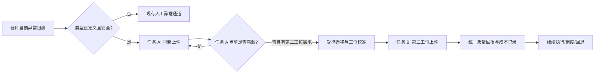
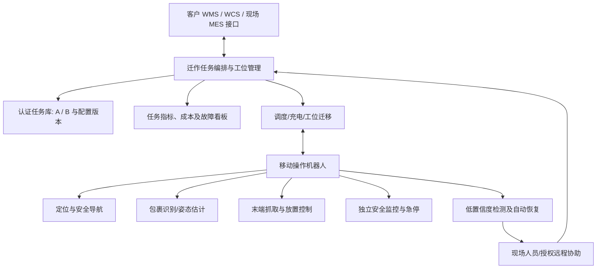
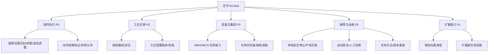
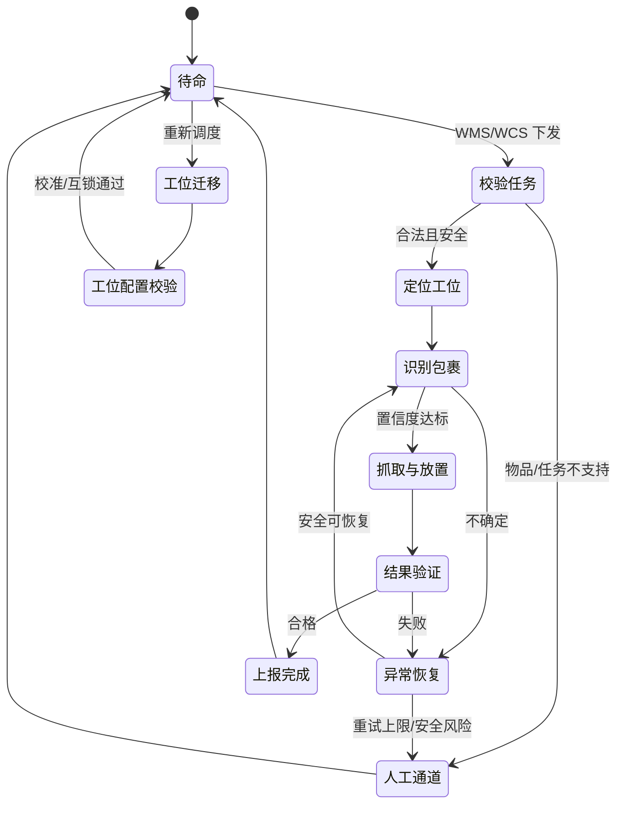
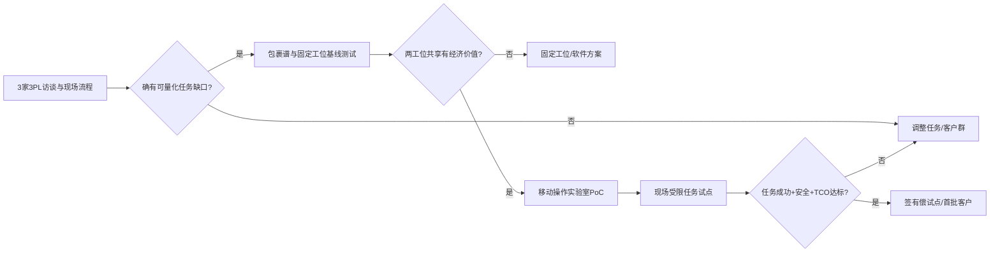

# 迁作 ReTask｜可重配置仓储移动操作系统

> **文档类型：** 商业化切入产品说明 / 市场机会与产品定义（非研发 PRD）  
> **名称：** “迁作”强调跨工位迁移与任务重新配置；**ReTask 为内部暂定英文代号**，正式品牌使用前须完成商标与域名检索。  
> **版本：** V1.0 · 2026-10-05  
> **阶段：** 公开市场与竞品研究完成；3PL 一手访谈、现场观察、成本核算及真实 PoC 待执行  
> **定位边界：** 面向 3PL 的独立 B2B 产品，不以“将来进入家庭”作为客户购买理由。  
> **证据约定：** `[事实]` 为文末有来源的公开信息；`[假设]` 为待验证的客户/市场判断；`[方案]` 为拟议产品；`[目标]` 为内部研究或 PoC 门槛，而非已达到的性能。

---

## 0. 产品概要

**一句话定位：** 迁作 ReTask 是面向多客户、多品类第三方物流（3PL）仓库的可重配置移动操作系统，使用一套机器人本体与可复用操作技能，在经过验证的多个工位之间切换，处理部分传统自动化难以经济覆盖的包裹操作任务。

**核心客户价值假设：** 与新建独立固定工作站或持续投入人工相比，降低部分业务切换时的重新配置费用、缩短工位重新部署时间，并通过跨工位利用率提高同一设备的投资效率。

**首个产品边界：** 聚焦已分类的非标准包裹姿态调整/重新上件；初步研究同一客户的第二个相邻任务是否可以复用机器人技能。**不宣称能处理任何异常包裹，也不预设移动机器人一定比固定机械臂经济。**

| 项目 | 产品定义 |
|---|---|
| 首批目标客户 | 具有两个及以上潜在人工操作工位、客户或 SKU 结构变化明显、存在一定自动化预算的中大型多客户 3PL 仓库（ICP 待验证） |
| 采购决策链 | 仓库运营/现场负责人提出问题，自动化工程负责人审查集成，运营高层/财务/采购评估 TCO，安全及 IT 负责人拥有准入权 |
| 核心差异化假设 | **已验证技能跨工位复用 + 部署流程标准化 + 可量化的重新配置经济性** |
| 建议本体 | 优先评估轮式移动操作平台；末端执行器与负载按真实包裹谱确定，不预设双足或双臂 |
| 商业化方式 | 客户共创 PoC → 带验收条件的试点 → 设备销售/系统集成或 RaaS；价格与 SLA 待报价和客户采购研究 |
| 当前立项状态 | **有条件进入客户发现；暂不批准量产硬件立项** |

## 1. 市场与用户分析

### 1.1 市场事实与适用边界

[事实] IFR《World Robotics 2025》统计，2024 年用于运输及物流的专业服务机器人销量约 **102,900 台**；该类别主要包含货物运输与搬运机器人，**不能等同于带机械臂的通用移动操作机器人销量**。同一报告显示，专业服务机器人 RaaS 存量在 2024 年同比增长 **31%** [R1]。它说明物流机器人和弹性采购模式已有市场基础，但不证明非标包裹移动操作的现成需求规模。

[事实] Extensiv 于 2025 年 8 月调查 200 多家第三方物流仓库，其公开摘要显示受访 3PL 平均服务 **3.6 个行业**，涉及零售、大宗商品、服装等 [R2]。这支持“多客户/多品类”作为值得调查的市场特征，**不支持推断每家仓库都频繁改造工位**；该样本及其地域背景也不能直接代表中国仓库。

[事实] 商业部署已经出现：GXO 与 Agility 于 2024 年签订多年 RaaS 合同，使用 Digit 在物流仓中与 AMR/输送线协同搬运料箱；Agility 后续披露其在 GXO 场地累计搬运超过 10 万个料箱 [R3][R4]。DHL 与 Boston Dynamics 于 2025 年签署涉及未来进一步部署 **1,000 台以上** Stretch 的合作备忘录，DHL 公布既有场景最高约每小时卸货 700 箱；备忘录是扩张计划而非已交付数量 [R5]。

**市场切入结论：** 物流行业愿意为具体、可度量的机器人任务试点和部署；同时成熟竞争者已经存在。迁作应从具体客户当前的“人工缺口 + 改造成本 + 两任务复用条件”出发，而非从“通用机器人未来会更灵活”出发。

### 1.2 客户细分与首批 ICP

| 细分客户 | 业务特征 | 适配判断 | 研究优先级 |
|---|---|---|---|
| 多客户电商履约型 3PL | 货品/包装形态变化、可能存在错峰工位和合同变化 | 具备可能验证两任务复用与快速重新配置的条件；必须查实际频率 | **优先** |
| 单一大客户稳定合同仓 | 工序和 SKU 长期稳定、吞吐量高 | 固定自动化通常有竞争力，不作为默认切入点 | 对照组 |
| 高度自动化快递分拨中心 | 高件量、成熟输送和分拣网络 | 固定分拣系统已有吞吐量优势；仅在经济上明显的例外任务中考虑 | 暂缓 |
| 低预算小型仓库 | 灵活、人工占比较高 | 设备闲置率、现金流和售后成本可能使其难以采购 | 暂缓 |
| 退货与逆向物流仓 | 包装不规则、人工检查/整理多 | 场景复杂且值得探索，但质检和开箱会引入新的能力边界 | 第二轮扩展 |

**首轮筛选条件（招募条件，不是市场统计）：** 优先联系至少有两个潜在工位、能提供匿名处理量/异常类别/人员排班信息、愿意讨论过往改造项目且具备 PoC 决策窗口的 3PL 仓库。先从国内目标区域实际访谈建立本地成本基线，不直接搬用海外报告中的劳动成本和 ROI。

### 1.3 决策单元与用户任务

| 角色 | 典型关注点 | 可能否决项目的原因 | 必须取得的证据 |
|---|---|---|---|
| 仓库运营经理（主要业务负责人） | 每小时有效件数、异常件积压、班次安排、业务切换 | 吞吐量下降、引入新的人工负担 | 分工位作业数据、近期实际异常事件 |
| 一线主管/操作员（直接用户） | 操作方便、恢复速度、交接流程 | 频繁故障或人机冲突 | 现场影随观察、失败恢复流程 |
| 自动化/设备负责人（技术评估） | WMS/WCS、现有输送线、稳定性与运维 | 需要大量定制集成、维修困难 | 系统拓扑、故障数据、最近一次改造耗时 |
| 安全、IT、信息安全人员（准入） | 风险评估、人员混行、远程视频与数据权限 | 无法通过安全审查、数据接口不允许 | 初步危险分析、网络和日志要求 |
| 财务、采购/高层（付款决策者） | 回本周期、现金流、合同期限、供应商持续性 | 年度总成本超过人工或固定方案 | 采购流程、财务口径、可接受试点条款 |

## 2. 场景机会与任务选择

### 2.1 机会地图

| 任务机会 | 具体业务问题 | 成熟替代方案 | 移动操作的独特价值**假设** | 最大反证 |
|---|---|---|---|---|
| 非标包裹姿态调整/重新上件 | 特定软包、倒伏纸箱或摆放姿态导致人工介入 | 固定抓取机械臂、导正机构、人工旁路 | 复用相同感知/抓取技能，覆盖多个工位 | 固定工作站已高效处理绝大多数包裹 |
| 两工位错峰共用设备 | 单一工作站不够满载，但两站各有间歇性人工需求 | 固定设备各一套、人员跨站支援 | 在空闲窗口迁移，摊薄设备成本 | 两站峰值重叠或迁移时间过长 |
| 跨工位重新部署 | 客户或 SKU 变化，原工位需要重新改造 | 工程师改配输送线/夹具/视觉 | 缩短切换工期、减少部分现场工程 | 客户年内几乎不改动，费用远低于机器人溢价 |
| 异常包裹恢复 | 滚落、堵塞、形变等导致人工救援 | 人工工位、远程引导、旁路机构 | 一套技能覆盖部分可分类的异常 | 真正剩下的异常太稀有、危险且无法标准化 |
| 多品类拣选 | 不同材质和包装的拣选 | 固定智能机械臂、GTP/AMR、人工 | 工位变化下复用移动抓取 | 高吞吐量场景固定设备 TCO 更低 |

**候选任务必须同时满足：** 近期确实有人工在做；每周/每天发生次数可以测量；环境与物体分布可以划出可交付边界；第二个工位的设备共享具有时间和空间可行性；不以纯算法演示替代客户结果。

### 2.2 两任务候选设计

**任务 A｜受限非标包裹重新上件。** 对于设备无法正确进入下一环节、但仍属于安全与规格许可范围的包裹，从预设异常缓冲位识别、抓取、调整姿态并放至指定输送带/容器。初期不接触破损漏液、危险品、无法辨识或超尺寸/重量物品。

**任务 B｜第二工位复用上件技能。** 在另一个经过预先认证的操作位置，对同一支持物品集或其子集执行取放/重新上件，复用视觉、抓取策略、状态机和运维界面，以**工位切换时间及成本**而非“机器人会第二个动作”验证价值。



**关键产品门槛：** 如果 A 和 B 实际相距很近、可通过一套固定机械臂或输送机构覆盖，或者两任务几乎总是同步高峰，移动底盘可能没有经济意义。产品应允许根据证据转为固定工作站/抓取软件，而不是强行保留移动能力。

## 3. 产品定位与竞争策略

### 3.1 价值主张

**把“通用性”具体化为可采购的指标：** 新物品类别的适配时间、新工位投入生产的时间、复用的软件/夹具比例、正常生产中断时间、两任务合计设备利用率，以及包含人工接管的单位有效处理成本。

产品承诺应限定为：**在支持的包装类别与经过校准的工位内，形成可测量、可复现的重新配置能力；不承诺处理未知品类和任意仓库异常。**

### 3.2 系统模块图



**集成原则：** 第一代尽量使用工位级 I/O、任务队列及经客户授权的标准接口，避免要求客户替换 WMS/WCS。具身模型只生成在认证动作与空间边界内的候选行为，安全控制与产线互锁拥有更高优先级。

### 3.3 功能树与优先级



## 4. 竞品与替代方案

| 竞品/替代方案 | 可核实公开能力与商业进展 | 对迁作的直接压力 | 必须验证的胜出条件 |
|---|---|---|---|
| **Plus One Robotics InductOne** | 双机械臂包裹上件；官网称持续 **2,200—2,300 件/小时**、峰值 **3,300 件/小时**，支持纸箱、透明/不透明软包及多种信封，采用低置信度人工辅助；指标均为厂商口径 [R6] | “非标包裹抓取”并非无人解决 | 客户有多工位低利用率或改造难题，而非追求单工位最高处理量 |
| **Berkshire Grey Core** | 适配多类 SKU；官网称可操作不规则/多孔/服装/软包等物品，最大约 **6 kg**，可接驳现有输送、自动仓储与其他系统 [R7] | 固定机械臂已经具备多品类能力与可配置接口 | 移动使实际 TCO 降低，不能仅比“能识别多少物品” |
| **Boston Dynamics Stretch** | 面向箱件卸货的移动机器人；2025 产品资料列示 **600—800 箱/小时**范围，依符合要求的箱体和拖车场景；DHL 扩张合作另见 [R5][R8] | “移动 + 机械臂”不是新产品类别 | 在 Stretch 不覆盖的**明确任务组合**中证明技能复用和跨工位效率 |
| **Agility Digit + Agility Arc** | GXO 已签署多年 RaaS 合同；移动料箱并接入现有 AMR/输送线，配套部署管理平台；累计 10 万箱为厂商披露里程碑 [R3][R4] | 通用本体商业化仍从有限、重复任务切入 | 在非标包裹任务、部署周期与经济性上提供不同价值 |
| **传统固定机器人工作站** | 可配置视觉、机械臂、吸盘和输送系统，高吞吐量、成熟运维 | 在稳定工位通常占优 | 必须存在值得迁移/共享的两任务需求 |
| **人工 + 输送/分拣系统** | 灵活处理复杂异常、短期投资低 | 当件量较低时总体经济性可能更优 | 实际减少人工工时或显著提高可用产能，不能只算理论替代人数 |
| **AMR + 通用机械臂集成方案** | 本身就能移动和取放；集成商可提供跨工位改造 | 是与本产品**形态最接近**的竞争方案 | 软件技能复用、安装周期、维护/SLA、单位成本实测优于其现有方案 |

**比较口径注意：** 上表各机器人执行的任务、包裹规格与工作条件不一样，不能直接比较“每小时件数”就宣布谁效率最高。必须在客户现场用同一包裹谱、同一上游供件方式、相同质量与停机统计口径做公平评估。

### 4.1 不依赖主观评分的竞品验证方法

1. 向客户收集现有人工/固定设备的真实基线和保密许可内的招标技术要求。
2. 形成**统一的包裹谱**：箱体、软包、尺寸/重量区间、表面与姿态、损坏/不规则占比。
3. 在同一时间窗比较有效完成件数/小时、成功率、误分与掉件、人工分钟/百件、可用率、恢复时间。
4. 额外比较工位迁移所需停机、现场工程人天、夹具改造、软件调参与安规复核成本。
5. 对设备两年及五年的**同口径 TCO**开展情景测算；未拿到报价的竞品只标“待报价”，不虚构价格。

## 5. MVP 范围、任务流程与验收思路

### 5.1 PoC 与首版范围

| 模块 | P0：PoC / 候选首版 | P1：扩展 | 明确不做 |
|---|---|---|---|
| 任务 | A：已分类非标姿态整理/重新上件；B：经过校准的第二工位同类取放 | 多品类拣选、更多异常类别 | 任意混合垃圾、危险品、未知破损件处理 |
| 物品 | 依据现场包裹谱锁定尺寸、重量、材料及表面条件 | 经数据验证逐步扩大范围 | 未标定的全部软包/所有纸箱 |
| 本体 | 候选轮式移动机械臂、可更换末端执行器 | 另一规格夹爪或扩展工位 | 默认双足、默认双臂、为了展示而加入高成本自由度 |
| 调度 | 与一个 WMS/WCS 或工位任务系统集成；A/B 任务版本管理 | 多台编队与仓库级优化 | 首期替换客户整个 WMS |
| 可靠性 | 可检测失败、可安全停止、固定恢复流程及人工异常分流 | 更多自动恢复策略 | 以频繁人工遥控伪装完全自主 |
| 运维 | 任务事件、报警、回放、工位重新部署向导、故障看板 | 跨客户技能市场/数据产品 | 无权限审查地上传客户原始影像 |

**候选验收任务：** 从已知异常缓冲位抓取一件安全、被支持的包裹，对准并放到指定传送带；稳定运行后迁往第二个已验收工位完成相似上件，比较**切换成本**与固定方案基线。



### 5.2 验收指标的定义比预设数值更重要

| 指标 | 定义 | 初期需要的基线 |
|---|---|---|
| 有效吞吐量 | 完成且通过质量检查的件数 / 含正常恢复的运行小时 | 同工位人工/固定设备的实际 P50、P90 |
| 端到端任务成功率 | 无人工介入、在规定时间内正确抓取并完成上件的任务占比 | 按包裹类别分层统计；不只报平均值 |
| 人工协助强度 | 人工处理分钟数 / 100 件；介入次数 / 100 件 | 现有人工工位真实处理量；远程与现场分别计费 |
| 系统可用率 | 排除事先约定计划维护后，系统可受理任务的时长占比 | 客户班次可用率目标 |
| 工位切换时间 | 从 A 最后一个合格件到 B 第一个**连续稳定生产**的合格件，中间含校准、安全复核与恢复 | 现有方案真实改造/重启时间 |
| 重配置成本 | 工程人天 + 新夹具/硬件 + 停机损失 + 现场培训 | 最近 1—3 次历史改造成本 |
| 双工位有效利用率 | 两任务的有效生产时长 / 总可用工作时长；必须扣除通行、等待与切换 | 两工位的真实错峰分布 |

**PoC 指标具体阈值必须按客户基线和合同共同设定。** 可以在实验室内部设置“可支持物品集≥90%自主成功率”等探索目标，但不得把实验室指标直接写进商业 SLA；整机必须单独进行安全风险评估。

## 6. 技术可行性、集成与安全

| 技术模块 | 可行性判断 | 重点技术风险 | 降风险方案 / 验证 |
|---|---|---|---|
| 视觉与包裹分类 | 成熟竞品显示限定包装谱下可商业部署 [R6][R7] | 透明软包、变形、反光、堆叠、面单干扰 | 现场采样分层测试；拒识/旁路机制 |
| 受限抓取和放置 | 吸盘、夹爪与传统运动规划均有成熟工程基础 | 不同材质的抓取成功率和掉落风险 | 根据物品谱选择可更换末端；抓取结果闭环检测 |
| 移动底盘 + 机械臂 | Stretch、Digit 等证明移动操作可落地于具体物流任务 [R3][R8] | 末端稳定性、底盘占地、工位精度、搬运与操作安全冲突 | 固定工位优先做基线，再证明迁移带来的增量价值 |
| 技能复用/重新配置 | 任务状态机、视觉/动作库、工位标定工程上可实施 | 新工位的布置变化导致技能失效 | 把技能版本、工位参数与安全配置分开；测回归时间 |
| 具身模型/VLA | 可用于感知/高层候选决策和技能扩展 | 分布外输入、不可解释失败与长尾恢复 | 初期限定技能输出与动作边界，保留确定性执行/验证 |
| WMS/WCS 集成 | 标准任务 API 与离散 I/O 常见，但每家仓库不同 | 遗留接口、现场时序、安全互锁与 IT 准入 | 首期仅接入单一系统、建立接口仿真和回退流程 |
| 人工异常恢复 | Plus One 已公开人机协同处理不确定包裹 [R6] | 人工成本、峰值积压、远程视角不足 | 优先自动重试，按安全等级分流至现场与授权远程人员 |
| 工业安全 | ISO 3691-4:2023 涉及无人驾驶工业车辆；ISO 10218-1/2:2025 分别覆盖工业机器人本体与集成应用 [R9][R10] | **移动机械臂组合的风险不被任何单一标准自动覆盖**；人员混行、夹点、掉件和输送线互锁 | 由认证/功能安全工程师按销售地区和实际系统确定适用标准，开展完整系统风险评估 |

### 6.1 分层执行原则

- **仓库调度侧：** 发出任务和可用工位、确认上下游设备状态，记录统一 KPI；不得直接覆盖安全级停机。
- **机器人本体：** 负责局部视觉、抓取、轨迹执行与移动避障；通信中断时进入经风险评估定义的安全状态。
- **独立安全控制：** 人员/障碍物检测、受限速度与空间、产线互锁、急停以及人工检修模式需要可测试的独立保护链路。
- **云端/远程协助：** 可做非实时模型服务、日志诊断或经授权的低频帮助，不依赖公网完成强实时控制；客户物品及商业数据遵循最小化与合同权限。

## 7. 成本结构与商业模式

### 7.1 客户为什么采购：按任务和工位算账

```text
现状年度成本 = 当前可消减人工成本 + 现有自动化新增/改造成本
             + 可归因的停机与返工损失 + 已发生的质量/安全相关成本
迁作年度总成本 = 设备折旧或 RaaS 租费 + 首次与新增工位集成摊销
               + 现场/远程人工协助 + 维修耗材/能源/保险/IT + 故障损失
年度净经济收益 = 有证据的现状成本节约与新增产能收益 - 迁作年度总成本
投资回收期 = 额外初始净投资 / 年度净经济收益（仅在净收益为正时）
```

**禁止重复计价：** 被释放的员工如果只是转岗、且没有带来可核实的增量产能或实际支出减少，不能把其全部工资直接记为节约；吞吐量提升若已经计入新增产出收益，不得再将同一停机影响重复计价。

### 7.2 用于内部敏感度分析的纯假设情景

下列数据**并非真实客户报价、行业均价或预测**，仅演示财务模型如何对关键参数敏感（单位：人民币万元/年）：

| 参数 | 假设场景 S1 | 假设场景 S2 |
|---|---:|---:|
| 实际可消减的人工与外包支出 | 25 | 12 |
| 可归因的重新配置及停机节约 | 11 | 3 |
| 机器人租赁/折旧与基础维护 | 24 | 24 |
| 首次集成摊销、人工接管与额外运维 | 9 | 9 |
| **年度净增益** | **+3** | **−18** |

相同设备与商业模式，只要实际可消减人工或重新配置频次远低于设想，投资回报就可能迅速转负。这说明“未来业务扩张可能有用”不能支撑今天的采购决策；客户当前的任务节约才是计算基础。

### 7.3 单台供给侧成本与商业化选项

- **硬件成本：** 机械臂/末端、移动底盘、安全传感器、视觉/算力、电池、现场互锁与制造装配；首期样机与批产成本分开核算。
- **客户交付成本：** 现场测绘、工位改造、WMS/WCS 集成、技能标定、安全验收、培训和保修。
- **持续性成本：** 运维、备件、在线监控、软件升级、远程/现场异常介入以及客户换仓后的迁移支持。
- **可选收入：** 一次性设备与系统集成；RaaS（月费 + SLA + 最低承诺期）；新增认证工位/技能服务费。**初期优先采用带真实验收的 PoC 合同，而不是免费长期帮客户跑流程。**

[事实] IFR 统计专业服务机器人 RaaS 存量 2024 年同比增长 31%，表明租赁在行业中已经是一条可行的采购路径，但不等于目标 3PL 客户一定偏好 RaaS [R1]。首批客户需分别询问设备折旧、OPEX 预算及合同期限，并取得实际采购流程信息。

### 7.4 重新配置成本是独立的价值检验

对每一次 A→B 的切换，分别记录：工位物理准备、地图/校准、末端更换、流程映射、WMS 接口调整、风险评估与人员培训的时间和金额。**只有这些可量化节约超过移动本体溢价及新增运维成本时，才可以把“快速重新配置”写成经证实的竞争优势。**

## 8. 客户研究与竞品验证计划

### 8.1 研究设计：先找问题，再推方案

**第一阶段（建议 2—4 周）：** 接触至少 **3 家不同 3PL**；目标访谈约 **12 人**，每家尽可能覆盖运营经理、一线/异常处理主管、自动化工程师和采购/财务人员。样本用于发现可测任务，不能用于估算全部 3PL 购买比例。

**招募筛选：** 是否为多客户仓；近期是否发生 SKU、流程或工位变化；是否有人工异常通道；是否可在保密协议下提供匿名处理量和排班数据；是否存在决策时间窗口。优先争取一线观察，避免只采访机器人爱好者或供应商。

**前 20—25 分钟不主动推销机器人，必须让受访者讲真实事件：**

1. 最近一周需要人工处理的非标包裹主要是哪几类？如何定义“非标”？
2. 请选择上一次卡住或被旁路的真实包裹，描述从发现到恢复的每一步。
3. 各类异常平均每天多少件、每件实际处理多久、班次怎么安排？
4. 现在的固定分拣/抓取设备能处理什么，剩下的 5%—10%（如确实存在）为何失败？不要预设比例。
5. 最近一次因新客户、新品类或工位变化而改造是什么时候？实际花了多少工程人天与停机时间？
6. 同一班次中，哪些两个工位存在错峰、空间分离与共同的物品操作技能？
7. 为什么没有部署固定机器人工作站、改造输送线或 AMR + 机械臂？是否曾试点失败？
8. 谁可以提供设备采购的回本门槛、合同期限、年度预算与安全准入要求？
9. 失败件现在由谁处理？需要什么技能？哪些异常绝不能由机器人触碰？
10. 什么条件下愿意提供试点场地与真实任务？能够接受停机、多长测试周期和何种验收方式？

### 8.2 现场观察与数据采集

| 数据包 | 记录方式 | 用途 |
|---|---|---|
| 同一工位连续任务流水 | 匿名时戳、件数、类别、成功/转人工 | 真实有效吞吐和异常比例 |
| 包裹谱 | 依客户许可记录尺寸、重量、包装、表面、异常姿态分布 | 限定支持物品集和末端设计 |
| 工位空间图 | 只存结构与设备布局；商业敏感部位脱敏 | 验证移动安全、轨迹与站间距离 |
| 最近 1—3 次重新配置 | 工单、工程人天、停工记录与配件费用 | 验证快速重新配置的价值 |
| 班次与峰谷分布 | 每工位按小时件数/人工调配 | 判断一台机器人能否跨工位共享 |
| 现有替代设备 | 客户实际型号、运行成本、合同条款（获许可后） | 建立可比 TCO 与竞品矩阵 |

若不能进入现场，则先做远程访谈与脱敏流程复盘；**不得将未经证实的受访者估算写成精确运行数据**。现场录像需获得场地、员工与保密相关许可。

### 8.3 证据优先级与机会评分

证据可信度依次为：**真实生产日志/已发生采购合同 > 现场直接观察 > 运营负责人给出的可复核记录 > 单次访谈回忆 > 对未来产品的兴趣表达**。

每项任务机会分别评分：当前年度实际成本（30%）、现有方案不足（20%）、跨工位/跨任务复用条件（20%）、安全与技术交付可能性（20%）、真实 PoC/采购路径（10%）。这是**团队内部的假设性筛选权重**，应依据最初三家客户资料校准；评分前保留原始证据链接，避免制造虚假的精确排名。

### 8.4 PoC 分阶段验证



**阶段 0：** 完成运营、技术、安全和采购四类问题访谈；拿到至少两个可测工位的历史数据。  
**阶段 1：** 在固定机械臂/台架上证明受限包裹处理，形成公平的单工位基线；若此时就无成本优势，慎重进入移动开发。  
**阶段 2：** 增加移动底盘，实现预认证 A/B 工位迁移；记录完整切换时间、交通干扰、安全审查与回退成本。  
**阶段 3：** 客户现场小流量试点，严格限定包装谱和工作时段；在同一口径下比较人工/固定设备/迁作。  
**阶段 4：** 只有验收证实持续净收益、安全和稳定性，才进入付费常态化部署与 SLA 谈判。

### 8.5 Go / Pivot / Stop 决策条件

| 判断 | Go：继续 | Pivot：转向 | Stop：停止当前硬件方案 |
|---|---|---|---|
| 真实问题 | 多家目标客户有可复核且可经济处理的任务成本 | 问题真实但目标工位/客户类型选择错误 | 仅有泛泛的“想用机器人”，无实际代价 |
| 移动必要性 | 至少一位潜在客户具备两个**非同时高峰**且值得共享设备的工位 | 只需要固定抓取软件/工位，则删除移动底盘 | 移动溢价长期高于可证明的配置节约 |
| 技术 | 支持物品集的安全、成功率和恢复成本可达到客户基线 | 减少包装种类或改为单任务 | 重大安全风险无法经济消除 |
| 商业 | 实际报价、折旧/租赁、接管成本和客户回本要求能够对齐 | 换采购模式或场景 | 仅依赖未来未知业务扩张才能回本 |
| 数据 | 已得到可授权的现场日志与失败归因 | 调整数据合作形式 | 核心任务无法合法获得测试数据 |

**所有商业门槛的具体数值须由客户采购条件和现场基线联合确定，而不是本说明文档自行捏造。**

## 9. 产品演进与可迁移资产

**阶段 I：** 单站受限非标包裹处理，验证算法、末端和真实经济性。  
**阶段 II：** 两个已认证工位重新部署，验证统一技能、软件配置与安全迁移流程。  
**阶段 III：** 以客户真实需求为依据扩展第三任务、跨仓部署与资产管理；不因“通用”口号预先增加自由度。  
**可迁移技术资产：** 多模态感知、物理取放、局部任务规划、异常恢复、遥操作、技能版本化和安全任务执行等可供未来其他场景研究复用。**但工业抓手、负载、速度和环境数据不等于家庭适用性**；家庭产品须独立完成消费者需求、安全、成本及隐私验证。

---

## 资料来源与证据说明

优先引用行业协会、实际部署客户、厂商产品页与标准组织。所有竞品指标均依其公开声明，不代表独立并列测试。资料核查日期：**2026-10-05**。

- **[R1]** IFR, *Service Robots See Global Growth Boom / World Robotics 2025*：https://ifr.org/ifr-press-releases/news/service-robots-see-global-growth-boom
- **[R2]** Extensiv, *2025 Third-Party Logistics Warehouse Benchmark Report*（2025 年 8 月、200 余仓库调查）：https://www.extensiv.com/resource-library/report/third-party-logistics-warehouse-benchmark-report
- **[R3]** GXO, *GXO Signs Industry-First Multi-Year Agreement with Agility Robotics*（2024-06-27）：https://investors.gxo.com/news-releases/news-release-details/gxo-signs-industry-first-multi-year-agreement-agility-robotics/
- **[R4]** Agility Robotics, *Digit Moves Over 100,000 Totes in Commercial Deployment*：https://www.agilityrobotics.com/content/digit-moves-over-100k-totes
- **[R5]** DHL Group, *MOU with Boston Dynamics for additional 1,000-robot deployment*（2025-05-13）：https://group.dhl.com/en/media-relations/press-releases/2025/dhl-group-signs-mou-with-boston-dynamics-and-accelerates-cross-business-automation-strategy.html
- **[R6]** Plus One Robotics, *InductOne*：https://www.plusonerobotics.com/inductone
- **[R7]** Berkshire Grey, *Core Robotic Picking System*：https://www.berkshiregrey.com/solutions/core-robotic-picking-system/
- **[R8]** Boston Dynamics, *Stretch Product Brochure 2025*：https://bostondynamics.com/wp-content/uploads/2024/01/Stretch-Brochure-2025-compressed.pdf
- **[R9]** ISO, *ISO 3691-4:2023 — Safety requirements for driverless industrial trucks*：https://www.iso.org/standard/83545.html
- **[R10]** ISO, *ISO 10218-1:2025 / ISO 10218-2:2025 — Industrial robot and robot application safety*：https://www.iso.org/standard/73933.html ；https://www.iso.org/standard/73934.html

> **尚缺证据：** 目标区域的 3PL 工位级成本、可竞争的固定/AMR 机械臂正式报价、细分包裹谱及异常占比、两工位负载分布、系统集成成本、移动组合机器人适用认证及客户真实试点采购承诺。上述信息必须在一手研究后更新，不得将海外厂商案例直接写成目标客户已验证需求。
