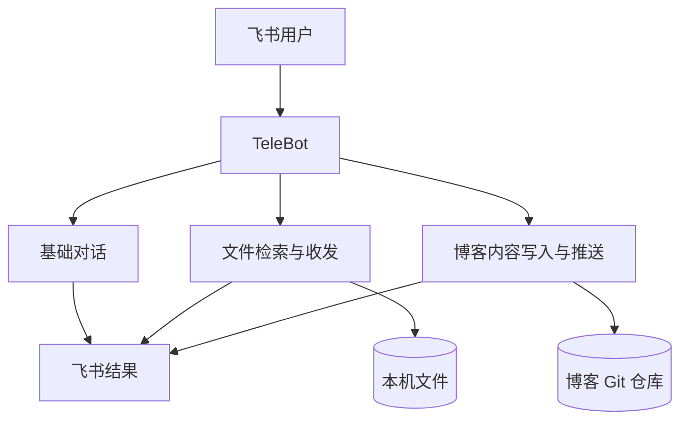
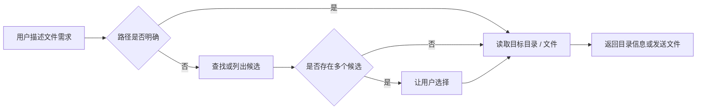
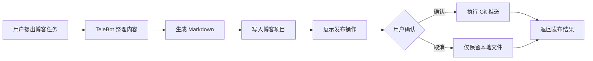

# TeleBot 产品需求文档（初始最小 MVP）

> **文档定位：** 这是 TeleBot 产品一开始的 PRD，设计的是起步阶段的最小 MVP，记录当时的需求与产品范围。产品当前状态见[《TeleBot 产品说明》](/portfolio/telebot/telebot-product-case/)。

> **产品定位：** 通过飞书连接手机与个人电脑，让用户在离开电脑时，仍能用自然语言调用本机能力并获得结果。  
> **MVP 核心：** 飞书对话 + 本机文件检索/收发 + 博客内容写入与推送。  
> **项目角色：** 独立完成产品定义、交互设计、开发与验证。

---

## 1. 产品摘要

TeleBot 起源于一个简单问题：

> **人在外面时，临时需要电脑里的资料或想继续处理电脑上的任务，能否不用远程桌面，而是直接在手机上“告诉电脑做什么”？**

第一版产品使用飞书作为跨设备入口，在电脑端运行 Agent：

```text
用户在飞书发消息
        ↓
电脑端 TeleBot 接收并理解任务
        ↓
调用本机文件 / 内容工具
        ↓
将文本、文件或执行结果返回飞书
```

MVP 不追求“万能 AI Agent”，只验证两个核心闭环：

1. **获取电脑中的内容：** 能聊天、查目录、找文件并把文件发回手机；
2. **让结果真正落地：** 能把生成内容写入博客项目，并在用户确认后完成 Git 推送。

产品核心判断：

> **用户需要的不是远程操作整台电脑，而是远程委托电脑完成一个明确任务。**

---

# 2. 需求分析

## 2.1 目标用户

第一阶段只考虑个人用户：

**个人开发者 / 知识工作者**

典型特征：

- 工作资料、代码和个人项目主要保存在电脑中；
- 会在通勤、面试、外出等场景临时需要电脑中的文件；
- 不希望为了一个简单任务打开远程桌面并在手机上操作完整桌面；
- 希望 AI 不只“回答”，还能完成文件交付或内容落地。

---

## 2.2 核心问题

### 问题一：设备割裂

人在手机端，但文件和工作环境在电脑端。

例如：

> “我在外面准备面试，突然需要电脑里的简历或项目资料。”

传统方案的问题：

| 方案 | 问题 |
| --- | --- |
| 远程桌面 | 手机操作桌面成本高，找一个文件也要逐层点击 |
| 云盘 | 必须提前同步，临时文件可能不在云端 |
| 发给自己 | 只能解决提前知道会用到的文件 |

因此第一项需求不是“远程控制电脑”，而是：

> **我描述目标，电脑帮我找到并把结果发回来。**

---

### 问题二：AI 输出没有真正完成任务

AI 可以生成文章、总结或笔记，但如果用户还必须：

1. 回到电脑；
2. 复制内容；
3. 创建文档；
4. 放入博客仓库；
5. 手动 Git 提交和推送；

那么任务实际上只完成了一半。

因此第二项需求是：

> **AI 生成的结果可以直接进入已有工作流，并在用户确认后完成发布。**

---

## 2.3 核心用户故事

### 用户故事 A：远程获取文件

> 作为一个离开电脑的用户，  
> 我希望直接在飞书中描述我要找的文件，  
> TeleBot 可以在电脑中帮助我定位并发送文件，  
> 从而不需要使用远程桌面。

典型过程：

```text
用户：帮我看看 ~/Documents/interview 下面有什么
TeleBot：返回目录内容

用户：把其中的 resume.pdf 发给我
TeleBot：发送文件
```

---

### 用户故事 B：模糊查找文件

> 作为一个记不清完整路径的用户，  
> 我希望先查看目录或描述文件特征，  
> 再逐步找到目标文件。

系统不要求用户提前知道精确路径。

---

### 用户故事 C：生成并发布博客

> 作为一个使用 Markdown + Git 管理博客的用户，  
> 我希望让 TeleBot 根据对话整理内容并写入博客项目，  
> 在确认发布后完成 Git 推送，  
> 从而可以在手机端完成一次内容发布任务。

---

# 3. 产品定位

## 3.1 产品定义

**TeleBot 是一个以即时通讯为入口的本地任务助手。**

用户负责表达目标和确认关键操作，电脑端 TeleBot 负责：

- 理解任务；
- 调用本机能力；
- 完成必要步骤；
- 将结果返回原会话。

---

## 3.2 第一版产品边界

MVP 只解决：

```text
飞书
  ↓
表达任务
  ↓
电脑端执行
  ↓
返回结果
```

第一版重点不是建立复杂 Agent 平台，而是验证：

> **“自然语言消息 → 本机任务 → 结果交付”是否真的比远程桌面更适合碎片化任务。**

---

# 4. MVP 范围

## 4.1 MVP 功能结构



---

## 4.2 P0：基础对话

### 需求

TeleBot 能通过飞书接收用户文本消息，并返回文本结果。

### 核心规则

- 用户直接使用自然语言提出任务；
- 对话是任务入口，不要求用户学习复杂命令；
- 多轮对话保留完成当前任务所需的上下文；
- 无法完成时应明确说明原因，不伪造执行结果。

### 验收标准

| 场景 | 通过标准 |
| --- | --- |
| 普通问答 | 用户发送文本后能收到回复 |
| 多轮任务 | 后续消息可以基于当前任务继续处理 |
| 执行失败 | 用户能够看到明确失败信息 |
| 重复事件 | 同一飞书事件不会导致任务重复执行 |

---

# 5. P0：文件检索与收发

## 5.1 用户目标

用户无需精确记住完整文件路径，也可以逐步找到电脑中的目标文件并发送到飞书。

---

## 5.2 核心流程



---

## 5.3 功能需求

### F1. 查看目录

用户可以询问指定目录下有哪些文件或子目录。

示例：

> “帮我看看 interview 文件夹里面有什么。”

系统返回简洁目录结果。

---

### F2. 逐步定位文件

如果用户只记得部分路径，可以：

1. 查看上一级目录；
2. 根据返回结果继续选择；
3. 最终定位目标文件。

系统不要求一次输入完整绝对路径。

---

### F3. 文件搜索

用户可以根据文件名或关键词寻找文件。

当匹配结果超过一个时：

> **展示候选，而不是自动猜一个。**

---

### F4. 文件发送

用户明确目标文件后，系统通过飞书将文件发送回当前会话。

---

### F5. 受控文件范围

TeleBot 只能访问配置允许的本机目录。

超出范围时：

- 不执行；
- 明确告诉用户该路径不可访问。

---

## 5.4 文件功能验收标准

| 场景 | 通过标准 |
| --- | --- |
| 查看目录 | 返回目标目录中的文件与子目录 |
| 文件名明确 | 能定位并发送正确文件 |
| 路径不完整 | 能通过多轮交互逐步定位 |
| 多个候选 | 展示候选并等待用户选择 |
| 文件不存在 | 明确反馈未找到 |
| 超出允许目录 | 拒绝访问并说明原因 |
| 文件发送 | 用户能在原飞书会话收到目标文件 |

---

# 6. P0：博客内容写入与推送

## 6.1 用户目标

将 AI 对话产生的内容直接保存到已有博客项目，并在确认后完成发布。

核心问题：

> **结果不能只停留在聊天窗口。**

---

## 6.2 核心流程



---

## 6.3 功能需求

### B1. 内容整理

用户可以基于当前对话要求：

- 整理为博客；
- 整理为 Markdown；
- 对已有内容进行补充或修改。

---

### B2. 写入博客项目

生成的 Markdown 可以直接写入指定博客仓库目录。

系统返回：

- 文件名；
- 保存位置；
- 写入结果。

---

### B3. 发布确认

写入本地文件与推送远端是两个动作。

Git 推送前必须明确告诉用户：

- 即将执行发布；
- 影响的项目；
- 当前准备推送的内容。

用户确认后才能执行。

---

### B4. 发布结果反馈

推送后返回明确结果：

- 发布成功；
- Git 执行失败；
- 网络失败；
- 本地文件已写入但未成功推送。

不能将“文件已生成”描述成“博客已发布”。

---

## 6.4 博客功能验收标准

| 场景 | 通过标准 |
| --- | --- |
| 生成 Markdown | 内容按要求整理为 Markdown |
| 写入项目 | 文件被保存到指定博客目录 |
| 用户取消推送 | 本地文件保留，但不执行远端推送 |
| 用户确认推送 | 执行 Git 推送 |
| 推送成功 | 用户收到明确成功反馈 |
| 推送失败 | 返回失败原因，并区分本地写入与远端发布状态 |

---

# 7. 关键产品规则

## 7.1 用户表达目标，系统完成操作步骤

TeleBot 不要求用户学习：

- 文件系统操作；
- Git 命令；
- 远程桌面操作流程。

用户只需要描述最终目标。

---

## 7.2 读取与修改采用不同操作门槛

```text
读取 / 查询
    ↓
可以直接执行

写入本地文件
    ↓
返回变更结果

发布 / 对外修改
    ↓
展示影响 → 用户确认 → 执行
```

第一版重点保证：

> **越不可逆或越影响外部状态的操作，用户控制权越明确。**

---

## 7.3 不猜测关键目标

以下情况应优先澄清：

- 多个文件同名；
- 目录描述存在多个候选；
- 博客目标文件不明确；
- 用户指令可能覆盖已有内容。

系统不能为了减少一轮对话而随意选择。

---

# 8. MVP 开发优先级

| 优先级 | 功能 | 目标 |
| --- | --- | --- |
| P0 | 飞书文本消息收发 | 建立跨设备任务入口 |
| P0 | 多轮对话 | 支持逐步完成任务 |
| P0 | 查看目录 | 用户可以探索本机文件 |
| P0 | 文件搜索 | 用户无需记住精确路径 |
| P0 | 文件发送 | 完成“找到 → 获取”闭环 |
| P0 | Markdown 写入博客 | AI 结果进入真实工作流 |
| P0 | Git 推送确认 | 控制对外发布风险 |
| P0 | 执行结果反馈 | 用户知道任务是否真正完成 |
| P1 | 更复杂文件操作 | 根据真实使用继续补充 |
| P1 | 更丰富任务类型 | 在 MVP 验证后决定是否扩展 |

---

# 9. MVP 验证

## 9.1 第一项真实验证：远程获取面试资料

真实场景：

> 人在外面准备面试，需要电脑中的资料，但手机没有该文件，也不记得完整文件路径。

实际流程：

```text
手机飞书询问目录
        ↓
TeleBot 返回文件结构
        ↓
用户指定目标文件
        ↓
电脑端找到文件
        ↓
飞书收到目标资料
```

结果：

**任务成功完成。**

这一验证说明：

> “消息触发 → 本机执行 → 结果返回”在真实使用场景中成立。

它验证的是产品基础交互闭环，而不是大规模用户价值。

---

## 9.2 博客流程验证

博客能力实现后，TeleBot 已可以将整理结果写入本机博客项目，并在确认后执行 Git 推送。

这一流程验证了第二个核心假设：

> **用户可以通过同一个聊天入口，不仅获取电脑中的内容，也可以让任务结果进入实际工作流。**

---

## 9.3 当前验证结论

| 假设 | 当前结论 |
| --- | --- |
| 飞书可以作为跨设备任务入口 | 已通过真实个人任务验证 |
| 用户无需完整路径也可以获取文件 | 已通过多轮目录探索验证 |
| 文件能够直接交付到移动端 | 已验证 |
| AI 结果可以直接写入本机项目 | 已实现并验证流程 |
| 高影响发布操作可以保留确认 | 已实现 |
| 是否具有多人普适价值 | 尚未验证 |
| 是否显著节省任务时间 | 尚无量化数据 |

当前阶段应表述为：

> **个人真实场景验证通过的可运行 MVP。**

而不是已经完成大规模产品验证。

---

# 10. 迭代复盘

## 10.1 第一版做对了什么

### 先验证任务闭环，而不是先做完整 Agent 平台

第一版只选择两个明确任务：

- 找到并拿到文件；
- 整理内容并发布博客。

两者都有明确的成功标准，因此可以快速判断产品是否真正解决问题。

---

### 复用飞书，而不是开发独立客户端

MVP 的核心假设是：

> **用户是否愿意通过消息委托电脑。**

因此没有必要先开发 App。

飞书已经提供：

- 移动端入口；
- 文本消息；
- 文件收发；
- 主动回复。

研发重点可以集中在电脑端任务执行。

---

### 从“回答”转向“完成任务”

文件回传和博客推送都要求结果真正落地。

TeleBot 的价值不是：

> “AI 告诉我该怎么做。”

而是：

> “我告诉 AI 我要什么，它帮我把任务推进到可直接使用的结果。”

---

## 10.2 第一版暴露的问题

MVP 完成后，也出现了新的需求。

### 文件越来越多，仅靠临时搜索不够

长期使用后，需要更稳定地组织项目资料和上下文。

由此产生后续的**知识管理**方向。

---

### 所有任务仍然需要用户主动发消息

对于每天、每周重复发生的任务：

> 用户每次重新发送相同指令并没有意义。

由此产生后续的**任务定时触发**方向。

---

### 代码任务的影响范围更大

普通文件读取和代码修改不是同一风险等级。

由此产生了更明确的：

- Inspect；
- Plan；
- Apply；
- 用户确认；

等代码执行流程。

---

## 10.3 产品演进原则

后续功能不应因为“技术上可以做”就加入。

判断标准统一为：

> **是否出现了一个新的真实任务断点，并且现有 MVP 无法有效完成？**

产品演进可以概括为：


其中只有前两项属于第一版 MVP。
