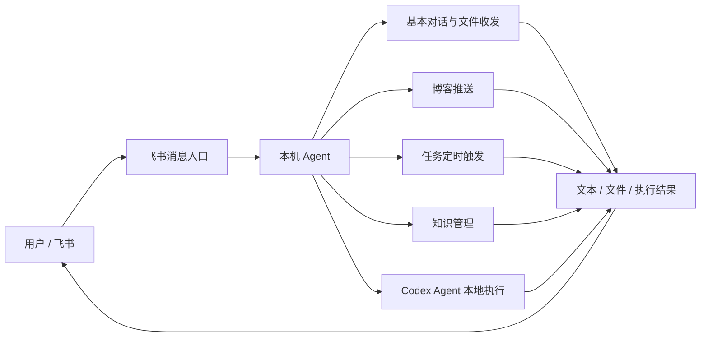
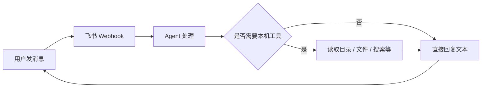
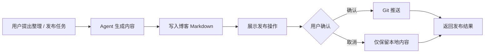
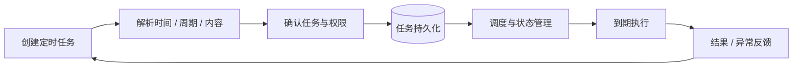
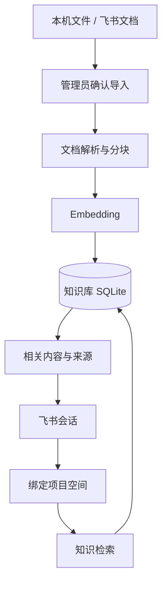
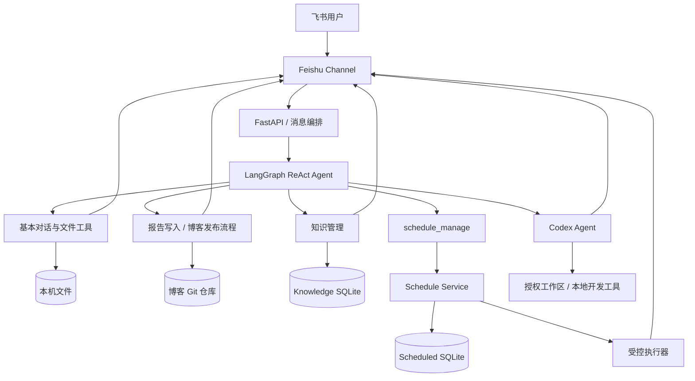
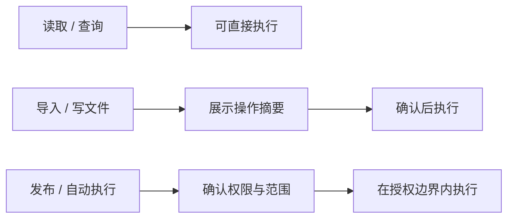

# TeleBot 产品案例：从远程取文件到任务驱动的本地 AI 助手

> 通过飞书连接个人电脑，把“人在外面无法使用本机能力”转化为“在聊天中直接委托任务，由电脑执行并返回结果”。

**项目角色：** 独立完成问题定义、产品设计、原型开发、工程实现与验证  
**产品形态：** 飞书 Bot + 本机 Agent 服务  
**当前主要功能：** 基本对话与文件收发、博客推送、任务定时触发、知识管理、Codex Agent 本地执行

---

## 01 项目概览

TeleBot 是一个以飞书为消息入口的本地 AI 助手。用户在手机或其他飞书客户端中直接描述任务，消息由电脑端服务接收后交给 Agent 处理；Agent 根据任务调用文件、知识库、报告写入、定时任务、Codex 等受控能力，再将文本、文件或任务执行结果返回原会话。

它解决的不是“如何把完整电脑桌面搬到手机上”，而是一个更具体的问题：

> **当用户不在电脑前时，能否直接说出目标，让电脑完成必要操作并把结果交付回来？**

项目从一次真实的“远程取面试资料”需求开始，随后逐步扩展到内容整理与博客推送、项目知识管理，以及无需用户重复发起的任务定时触发。

TeleBot 当前的核心不是某一个工具，而是形成了一套统一的任务交互方式：

> **用户提出目标 → 系统识别所需能力 → 本机受控执行 → 结果回到原会话**

---

## 02 需求分析

### 2.1 起点：人在外面，却临时需要电脑里的内容

项目最初来自一次实际场景：人在外面准备面试，突然需要电脑中保存的资料，但手机里没有，自己只记得大致目录，不记得完整路径。

常见替代方案分别存在不同问题：

| 方案 | 优势 | 在该场景中的问题 |
| --- | --- | --- |
| 远程桌面 | 可以完整操作电脑 | 手机屏幕上逐层浏览目录、传输文件，操作成本高 |
| 云盘同步 | 适合固定资料长期同步 | 临时文件未提前同步时仍然无法获得 |
| 即时通讯 + 本机 Agent | 可以直接描述目标并接收结果 | 依赖本机服务运行，但更适合边界明确的短任务 |

第一次真实使用中，我先在飞书询问目标目录结构，再指定文件，TeleBot 在电脑端找到文件并发送回当前会话。

这一经历让我把原始问题进一步抽象为：

> 用户真正需要的往往不是“远程控制电脑”，而是“远程委托电脑完成一个任务”。

### 2.2 需求继续扩展

当“取文件”闭环成立后，我在实际使用中又遇到三类相邻问题：

**内容处理结果如何真正落地？**  
AI 可以生成内容，但如果结果还需要用户回到电脑前复制、保存、提交，那么移动端委托的价值会在最后一步中断。因此增加了“写入本机项目并在确认后推送”的博客发布能力。

**本机资料越来越多后，如何让 Agent 找到正确上下文？**  
单纯依赖文件搜索无法解决项目资料的长期组织、权限和检索问题，因此增加了按项目空间组织的知识管理能力。

**重复任务为什么还要每天重新发一次消息？**  
即时对话只能解决“现在做一次”的任务。对于每天、每周或指定时间执行的事务，用户需要的是“一次委托，后续按计划执行”，因此增加任务定时触发能力。

由此，TeleBot 的问题边界从“远程访问文件”扩展为：

> **以聊天作为统一入口，让用户在离开电脑后仍能调用本机已有能力，并让一次性任务、内容交付、知识检索和周期任务在同一套受控执行逻辑下完成。**

---

## 03 产品定位

### 3.1 产品定义

**TeleBot 是一个任务驱动的本地 AI 助手。用户通过飞书提出目标，系统按任务加载必要上下文和工具，在个人电脑上执行操作，并将结果返回原会话。**

产品强调三个关键词：

- **任务驱动：** 用户先提出明确目标，而不是让 Agent 持续自主寻找任务；
- **本地执行：** 文件、项目、Git 仓库等能力发生在用户自己的电脑环境中；
- **受控操作：** 查询、读取与修改、发布等操作采用不同的权限和确认门槛。

### 3.2 目标用户

当前主要面向：

- 以个人电脑作为主要工作环境的开发者和知识工作者；
- 文件、代码、项目资料长期保存在本机；
- 经常需要在离开电脑后获取、整理或处理本机内容；
- 希望用手机完成“任务委托”，而不是在小屏幕上远程操作完整桌面。

核心 JTBD：

> **当我不在电脑旁时，希望直接告诉电脑我要完成什么，让它在允许的范围内执行，并把结果发回来。**

### 3.3 产品边界

TeleBot 不把“能力越多”当作产品目标。它更关注：

1. 用户能否用一个熟悉的消息入口发起任务；
2. 系统是否调用了与当前任务匹配的能力；
3. 高影响操作是否保持可确认、可追溯；
4. 最终结果是否真正交付，而不是只停留在 AI 对话中。

---

## 04 MVP：先验证“消息能不能变成任务”

第一版没有先做知识库、自动发布或定时系统，而是用“查看目录并发送文件”验证最基础的产品假设：

> **用户能否通过聊天入口发出一个明确目标，由电脑执行并返回正确结果？**

### 4.1 MVP 范围

| 功能 | 是否纳入第一版 | 原因 |
| --- | --- | --- |
| 普通消息接收与回复 | 是 | 建立最小交互入口 |
| 查看本机目录 | 是 | 用户不一定记得完整路径 |
| 读取并发送指定文件 | 是 | 可以形成完整结果交付 |
| 文件搜索与多步任务 | 逐步增加 | 在基础闭环成立后扩展 |
| 博客推送 | 否 | 属于结果落地场景 |
| 知识管理 | 否 | 属于长期资料组织问题 |
| 任务定时触发 | 否 | 属于从即时任务向长期委托的扩展 |

### 4.2 MVP 成功标准

第一版不以“做了多少工具”为标准，而以用户是否完成任务判断：

> **手机端最终是否收到了自己需要的那份文件。**

这使第一轮验证能够快速完成，也避免项目一开始就变成一个功能庞杂但没有真实闭环的通用 Agent。

---

# 05 五个核心功能模块

## 5.1 基本对话与文件收发：把聊天变成本机任务入口

### 用户问题

人在外面时，常见需求并不是复杂自动化，而是：

- “帮我看看这个目录里有什么。”
- “把那份简历发给我。”
- “帮我找一下项目里的某个文件。”
- “看看这个问题，再把结果发回来。”

如果仍然需要用户知道完整文件路径，或者通过远程桌面逐层操作，聊天入口的价值会明显下降。

### 产品方案

TeleBot 将飞书作为唯一消息入口，电脑端接收飞书事件后交给 Agent 处理。普通对话、多步任务、本地文件读取和文件发送都通过同一会话完成。

### 关键产品规则

**用户不需要精确记忆路径。**  
可以先查看目录，再逐步收敛到目标文件；模糊目录存在多个候选时，不直接猜测，而是让用户选择。

**文件能力受到本机目录边界约束。**  
文件读取和发送只能发生在允许目录内，避免 Agent 因自然语言指令访问任意本机位置。

**结果直接回到原会话。**  
文本由飞书回复，文件直接发送到当前会话，不要求用户再切换到其他传输工具。

**修改操作与读取操作区分。**  
读取类动作可以直接完成；覆盖、删除等会改变本机状态的动作需要额外确认，并使用隔离删除等保护机制。

### 技术落地

当前实现以 FastAPI 接收飞书事件，由 LangGraph ReAct Agent 进行任务处理；飞书通道负责事件解析、鉴权以及文本／文件发送，本地工具提供文件、搜索、报告和受限 Shell 等能力。会话状态通过 SQLite 持久化。

### 功能演示

演示通过飞书请求本机文件，并将文件发回当前会话。

<video controls preload="metadata" style="display: block; width: 100%; max-width: 48rem;">
  <source src="/videos/telebot/file-transfer.mp4" type="video/mp4">
  当前环境不支持内嵌播放，可<a href="/videos/telebot/file-transfer.mp4">直接打开视频</a>。
</video>

---

## 5.2 博客推送：让 AI 结果从“回复”走到“发布”

### 用户问题

对话中生成一篇整理好的笔记或博客并不代表任务真正完成。如果用户仍需要回到电脑前：

1. 复制 AI 输出；
2. 新建 Markdown；
3. 放入博客项目；
4. 手动执行 Git；
5. 再推送远端；

那么“远程委托”在最后一段流程中仍然断开。

### 产品方案

TeleBot 将博客发布拆成两个阶段：

1. **内容落盘：** Agent 根据任务整理内容，并将 Markdown 写入本机博客项目；
2. **确认发布：** 涉及 Git 推送等会改变外部状态的动作时，先向用户展示操作意图，再在确认后执行。

### 关键产品决策

**生成和发布分离。**  
“写好文章”和“把内容推到远端”不是同一风险等级，因此不把两者绑定成一次不可撤回的自动操作。

**让结果真正进入用户已有工作流。**  
TeleBot 不另建一个内容管理平台，而是复用现有 Markdown 博客仓库，使 AI 输出直接落到用户已经使用的内容系统中。

**对外部状态变化保留确认。**  
Git 推送属于高于普通文本回复的影响操作，因此使用明确的确认流程。

### 产品价值

这一模块把 TeleBot 从“能回答问题”推进到“能完成交付”。用户在移动端完成的不再只是一次对话，而是：

> **提出内容任务 → 本机生成文件 → 用户确认 → 发布结果返回**

### 功能演示

演示 TeleBot 将整理后的内容写入博客并推送发布。

<video controls preload="metadata" style="display: block; width: 100%; max-width: 48rem;">
  <source src="/videos/telebot/blog-publishing.mp4" type="video/mp4">
  当前环境不支持内嵌播放，可<a href="/videos/telebot/blog-publishing.mp4">直接打开视频</a>。
</video>

---

## 5.3 任务定时触发：从即时响应扩展到长期委托

### 用户问题

即时聊天适合“现在帮我做一次”，但不适合：

- 明天 9 点提醒我检查报告；
- 每周一运行一次固定任务；
- 每天按既定规则整理信息；
- 指定时间调用已有工具或 Skill 并把结果发回来。

如果每次都需要用户重新发消息，重复任务仍然没有被真正自动化。

### 产品方案

TeleBot 在即时任务之外增加独立的定时任务生命周期。用户可以通过自然语言或 `/schedule` 管理任务，系统将任务定义持久化，到期后由调度器触发，再根据权限模式提醒、申请执行授权或自动执行。

### 支持的核心能力

- 单次、每日、每周任务；
- 自然语言和显式 `/schedule` 管理；
- 任务创建、修改、删除确认；
- 提醒、逐次执行授权、预授权自动执行等权限方式；
- 错过任务的 skip / run_once / ask 策略；
- 执行历史和事件记录；
- 执行结果主动发送到飞书；
- 发送失败后进入通知队列并重试。

### 关键产品决策

**任务创建与执行授权分离。**  
“把任务存下来”不等于“未来可以无限制自动操作”。预授权只覆盖创建时确认的工具和目录范围。

**任务状态与单次执行结果分离。**  
周期任务一次执行失败，不意味着整个周期任务永久失效；系统记录本次失败，并继续维护下一次执行。

**调度不仅负责‘到点触发’。**  
它还要处理错过、重复触发、超时、执行队列和下一周期计算，因此被设计成“调度 + 状态管理”而不是一个简单定时器。

### 示例场景

“秋招岗位定期更新”只是这一能力的一个调用案例：

> 每周指定时间调用已有的第三方秋招岗位 Skill，完成检索后把结果发回飞书。

本次产品能力的重点是**任务如何被创建、确认、调度、授权、执行和反馈**，而不是秋招 Skill 本身。

观看[定时任务功能演示](/portfolio/telebot/telebot-scheduled-prd/#功能演示)，了解创建任务、到期触发和结果反馈的流程。

---

## 5.4 知识管理：让本机资料成为可控、可复用的项目上下文

### 用户问题

文件数量增加后，“能访问文件”并不等于“能有效使用资料”。

实际问题变成：

- 哪些资料属于同一个项目？
- 当前聊天应该使用哪一组资料？
- 谁可以导入、删除和访问？
- 新资料如何进入索引？
- Agent 如何在不扫描全部电脑文件的情况下找到相关内容？

### 产品方案

TeleBot 将知识组织成独立的**项目空间**。项目空间与飞书聊天并非一一绑定：一个空间可以绑定多个群聊或私聊，但每个会话同一时间只使用一个空间；访问还需要校验用户是否是空间成员。

### 核心功能

**项目空间管理**

- 创建空间；
- 查看可访问空间；
- 将当前聊天绑定到指定空间；
- 添加成员和管理员。

**受控资料导入**

- 绑定允许导入的本机目录；
- 导入单个文件、目录或模糊目录描述；
- 导入飞书 docx 文档；
- 导入前展示清单并确认。

**检索与查看**

- 在当前空间内搜索；
- 查看已导入文档；
- 查询预算使用情况；
- 通过 MCP 向其他 Agent 提供只读知识检索能力。

### 关键产品规则

**知识范围先于搜索。**  
不做跨电脑、跨项目的全局搜索，先确定项目空间，再在空间内检索。

**导入是显式行为。**  
飞书云文档不会自动持续同步；本地目录也必须先绑定并确认导入，避免“为了方便检索而默认读取所有资料”。

**成员权限与聊天绑定分开。**  
把某个空间绑定到群聊，不代表群内所有人自动拥有读取权限。

**成本可见。**  
Embedding 使用独立预算控制，未变化内容通过哈希去重，避免重复索引。

### 产品价值

这一模块把“临时找文件”升级为“长期维护项目上下文”。它不仅提升检索能力，也为后续不同 Agent、MCP 客户端复用同一知识源提供基础。

---

## 5.5 Codex Agent：增强本地复杂任务的执行能力

### 用户问题

查看目录、读取文件等工具能够完成边界明确的操作，但代码修改、项目整理等任务往往需要结合工作区上下文，连续使用本地文件系统和开发工具。用户希望在飞书中提出目标后，电脑能够完成这些步骤并返回可检查的结果。

### 产品方案

TeleBot 通过 Codex Agent 模块承接需要多步操作的本地任务，在授权工作区内使用已有文件、代码仓库和开发工具，并将执行结果返回飞书。飞书继续承担任务入口和结果交付，Codex Agent 增强实际执行能力。

### 关键产品规则

**工作区授权独立确认。**

调用 Codex 不代表开放整个本机文件系统；任务需要明确允许访问和修改的工作区，定时调用也只能在预授权范围内执行。

**复杂执行仍遵循操作边界。**

文件修改、命令执行和对外发布继续遵循各自的权限与确认规则，并向用户反馈结果或异常，便于检查任务是否真正完成。

---

## 06 产品整体架构

五个模块共享同一个消息入口和本机执行环境，但解决的是不同层次的问题。

从产品视角看，这套架构对应五种任务关系：

| 模块 | 用户与电脑的关系 |
| --- | --- |
| 基本对话与文件收发 | “现在帮我拿到/处理这个东西” |
| 博客推送 | “把结果真正落到我的工作流里” |
| 任务定时触发 | “以后按约定时间继续帮我做” |
| 知识管理 | “以后做任务时知道该从哪里找上下文” |
| Codex Agent 本地执行 | “结合我的项目和工具，完成需要多步操作的本地任务” |

---

## 07 关键方案取舍

### 7.1 复用飞书，而不是开发独立 App

选择飞书作为入口，是为了接入飞书丰富的生态，方便地复用其消息、文件、云文档和主动通知等接口，也让 TeleBot 能够承接用户已经在飞书中进行的工作。例如，用户保存在飞书中的项目文档可以通过已有接口导入知识库，在原有会话中继续检索和使用。

这种选择让任务委托自然融入已有工作流，减少资料迁移和工具切换，同时把研发投入集中在 Agent 与本机执行闭环。

### 7.2 本地执行，而不是全部迁移到云端

目标资料和项目原本就在个人电脑中。让 Agent 靠近数据，可以直接复用现有文件、Git 仓库和开发环境，减少为了使用 AI 而重新迁移工作资料的成本。

对应代价是：本机离线会影响任务执行，因此定时任务必须额外处理错过、恢复和通知问题。

### 7.3 按任务加载能力，而不是所有工具默认开放

普通对话、文件读取、知识检索、定时管理和 Codex 操作具有不同影响范围。TeleBot 将它们拆成受控工具或显式流程，而不是让 Agent 在任何消息下都拥有全部操作能力。

### 7.4 高影响操作增加确认门槛

产品按照操作影响程度区分：

这种设计牺牲了一部分“完全自动”的流畅度，但换来了更清晰的控制感和可追溯性。

---

## 08 实际验证与实现结果

### 8.1 已完成的真实任务闭环

最早的文件场景已经在个人真实使用中完成：

1. 在手机飞书查看电脑目录；
2. 根据返回结果指定文件；
3. 电脑端读取目标文件；
4. 文件发送回当前飞书会话；
5. 在外部场景中直接使用该资料。

这验证了最基础的价值：

> **聊天消息可以成为本机任务的入口，而不只是另一种对话 UI。**

### 8.2 当前工程实现

当前仓库已经形成相对独立的能力模块：

| 模块 | 当前实现证据 | 产品价值验证状态 |
| --- | --- | --- |
| 基本对话与文件收发 | 飞书事件、ReAct Agent、本机文件读取与发送、会话持久化 | 已有真实任务验证 |
| 博客推送 | 报告写入、文件变更确认、可选 Git 推送流程 | 已实现并用于个人工作流，仍需持续记录使用数据 |
| 任务定时触发 | 独立 ScheduleService、SQLite 持久化、自然语言／命令管理、执行历史和测试模块 | 功能已实现；长期委托价值仍需连续使用验证 |
| 知识管理 | 项目空间、成员与聊天绑定、文件／飞书文档导入、Embedding、检索和 MCP | 功能已实现；检索价值仍需更多真实任务验证 |

### 8.3 当前不足

目前最大的问题已经从“能不能做出来”转向“哪些能力值得长期保留”：

- 使用者目前主要还是本人，用户样本有限；
- 不同模块缺少统一的任务成功率、耗时和成本记录；
- 部分能力由技术探索驱动，仍需要更多真实任务反证其必要性；
- 本地运行带来的离线、环境依赖和权限管理，需要在持续使用中进一步验证。

---

## 09 迭代复盘

### 9.1 做对的事情

**先从真实任务，而不是从“大而全的 AI 助手”开始。**  
远程取文件的成功标准极其明确，使第一版可以快速判断交互闭环是否成立。

**每次扩展都解决上一阶段暴露出的新问题。**  
文件解决“拿不到”；博客推送解决“结果没有真正落地”；知识管理解决“资料越来越多后上下文失控”；定时触发解决“重复任务仍需要重新发起”。

**把安全边界做成产品规则，而不是只留在工程实现。**  
目录范围、操作确认、项目空间成员、定时任务预授权都直接影响用户是否敢让 Agent 获得本机能力。

### 9.2 需要改进的地方

**探索服务器部署，减少对本地持续运行的依赖。**

可以考虑将消息接收、任务调度等常驻服务部署到服务器，让它们不再依赖个人电脑持续在线。同时需要设计服务器与本地执行端的协作方式，保留对本机文件系统、代码仓库和开发工具的受控访问，例如由服务器编排任务、本地 Agent 在授权工作区内执行。涉及本机资源的任务仍需要电脑在线，因此还应明确离线时的等待、恢复执行和结果通知机制。

**模块多了以后，需要统一衡量。**

下一阶段应该让五个模块都回到相同指标：用户想完成什么、是否完成、用了几轮、耗时多久、是否发生错误、是否愿意再次使用。

---

## 10 下一阶段验证方式

后续不再以“再增加多少工具”为主要目标，而是连续记录真实任务。

建议统一记录：

| 指标 | 说明 |
| --- | --- |
| 任务类型 | 文件、博客、定时、知识、Codex 本地执行或其他 |
| 用户目标 | 本次真正希望完成的事情 |
| 是否完成 | 最终结果是否达到目标 |
| 完成时间 | 从发起到收到可用结果 |
| 人工介入 | 中途是否需要回到电脑处理 |
| 异常类型 | 权限、路径、执行、网络、结果质量等 |

产品下一步要验证的不是“TeleBot 能不能继续扩展”，而是：

> **哪些本机任务真正适合通过消息入口长期委托，以及用户愿意把多大范围的执行权交给它。**
