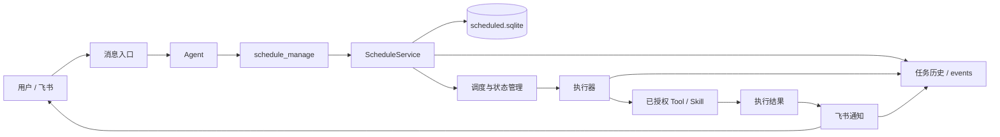
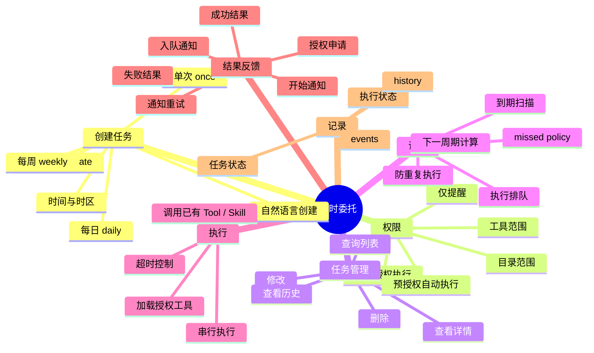
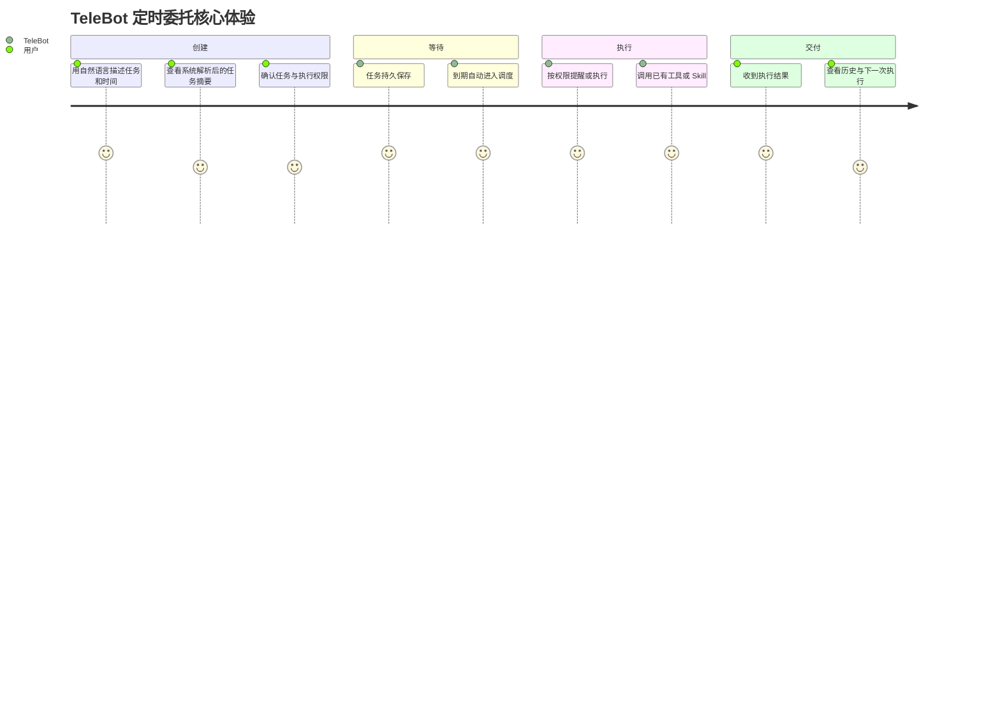
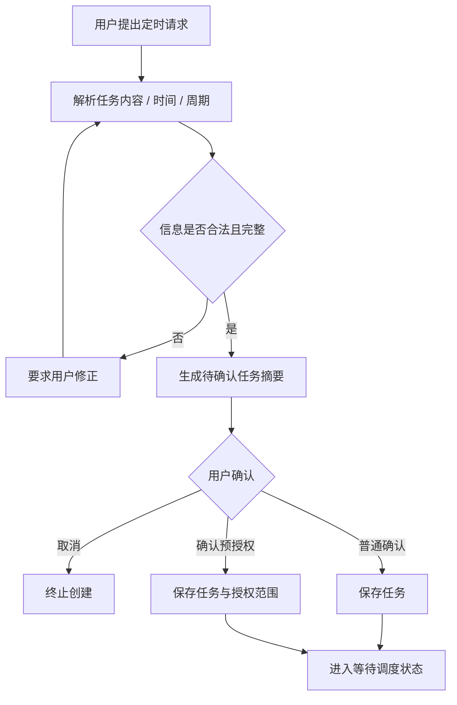
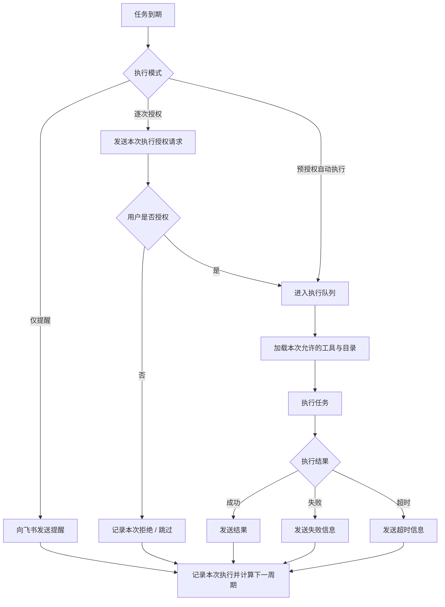
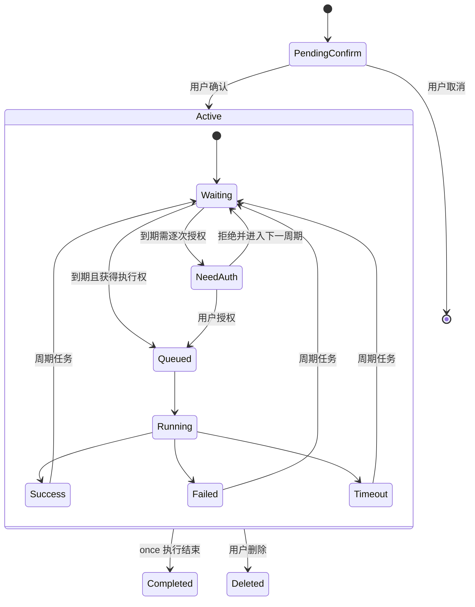
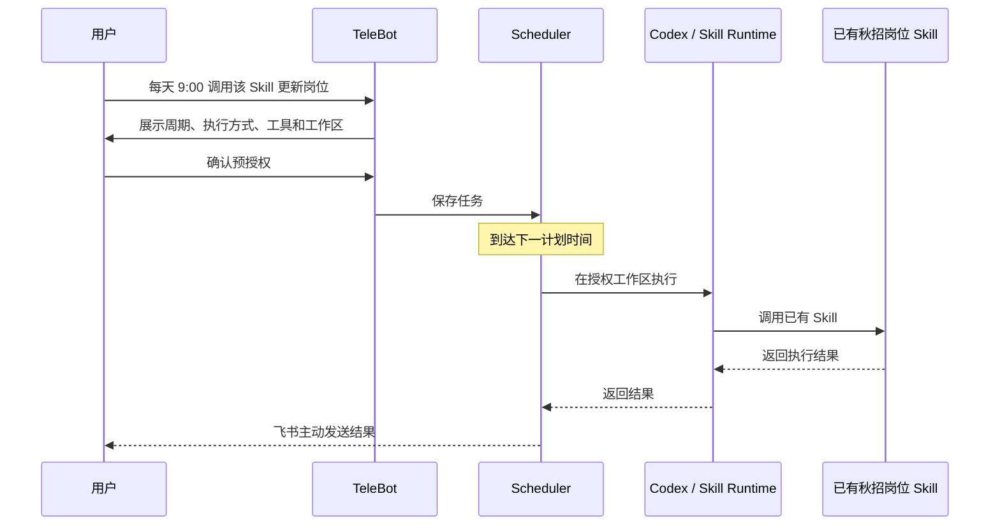

# TeleBot「定时委托」PRD：任务定时触发与主动执行

> **功能名称：** 定时委托（Scheduled Delegation）  
> **功能范围：** TeleBot 任务定时触发  
> **主要入口：** 飞书自然语言消息、`/schedule` 命令  
> **示例场景：** 到期调用已有第三方秋招岗位 Skill，并将执行结果返回飞书  
> **说明：** 秋招岗位 Skill 不是本次迭代开发内容，仅作为“定时调用已有能力”的示例

---

## 01 背景

TeleBot 原有任务都由用户即时触发：

> 用户发消息 → Agent 执行 → 返回结果

这一模式可以完成文件查询、知识检索、报告生成等即时任务，但对于“以后再执行”或“周期重复执行”的任务，用户仍需要每次重新发起。

典型表达包括：

- “明天晚上七点提醒我检查报告。”
- “每天早上九点执行一次这个任务。”
- “每周一帮我运行一次固定流程。”
- “周五下午调用这个 Skill，把结果发给我。”

这类需求的核心并不是增加一个简单的计时器，而是建立一套完整的**任务生命周期**：

> **解析时间 → 创建任务 → 确认权限 → 持久化 → 到期调度 → 执行 → 结果反馈 → 进入下一周期**

因此，本次迭代在 TeleBot 的即时任务体系之外增加“定时委托”能力，使用户可以将一个任务从“现在执行一次”转换成“未来按约定继续执行”。

---

## 02 产品目标

定时委托需要解决五个问题：

1. **用户能自然地说清“做什么、什么时候做”。**
2. **任务在程序重启后仍然存在，而不是依赖一次内存定时器。**
3. **创建任务与允许未来自动执行是两个不同的授权动作。**
4. **周期任务的一次失败不会让整个任务永久失效。**
5. **用户能够知道任务何时执行过、结果如何以及下一次何时执行。**

核心体验从：

> **每次到时间，我还要重新告诉 TeleBot 做什么**

转变为：

> **我只需要委托一次，TeleBot 按确认过的时间和权限继续执行。**

---

## 03 功能模块图



### 模块职责

| 模块 | 主要职责 |
| --- | --- |
| 消息入口 | 接收用户自然语言或 `/schedule` 指令 |
| Agent | 判断用户是在创建、查询、修改或删除定时任务 |
| `schedule_manage` | 将当前飞书消息和可信会话身份交给定时服务，不允许模型伪造用户身份 |
| ScheduleService | 解析、校验、确认并持久化任务 |
| 调度与状态管理 | 扫描到期任务、生成执行、处理错过时间、重复执行和下一周期 |
| 执行器 | 在已授权工具和目录范围内执行任务 |
| 通知模块 | 发送入队、开始、完成、失败、授权申请等消息 |
| 历史与事件 | 保存任务变化、执行结果和重要事件，供查询与问题定位 |

---

## 04 功能树



---

## 05 核心体验



本功能最重要的产品变化是：

> **用户离开当前会话后，任务仍然继续存在。**

这意味着系统第一次需要对“未来的执行权”负责，因此任务确认、执行授权、状态记录和异常反馈都成为核心体验的一部分。

---

# 06 用户流程

## 6.1 创建任务

用户既可以直接说：

> “每周一早上九点调用已有的 autumn-recruitment-tracker skill 更新岗位，把结果发给我。”

也可以使用显式命令创建。

系统首先解析：

- 任务内容；
- 首次执行时间；
- 时区；
- 周期规则；
- 执行模式；
- 需要调用的工具；
- 工具需要访问的目录范围。

然后向用户展示任务摘要，而不是解析完成后立即生效。



### 创建摘要应让用户看清

| 信息 | 示例 |
| --- | --- |
| 任务内容 | 调用已有秋招岗位 Skill 并返回结果 |
| 首次执行 | 2026-10-10 14:00 |
| 时区 | +08:00 |
| 周期 | 每周一 |
| 执行模式 | 预授权自动执行 |
| 工具范围 | `codex_apply` |
| 目录范围 | 指定 Job workspace |
| 错过策略 | `skip` / `run_once` / `ask` |

创建、修改和删除都属于会改变未来行为的操作，因此必须先确认；查询任务和历史不需要确认。

---

## 6.2 到期执行

任务到期后，系统根据执行模式进入不同流程。



用户不需要在每个周期重新创建任务，但系统也不会因为任务已经存在，就默认获得超出原授权范围的新权限。

---

## 6.3 查询与管理

当前任务体系提供以下主要管理行为：

| 用户意图 | 对应行为 |
| --- | --- |
| “我有哪些定时任务？” | 查询任务列表 |
| “看看这个任务的配置。” | 查看任务详情 |
| “把它改成每周三晚上八点。” | 修改任务并重新确认 |
| “这个任务以前执行得怎么样？” | 查询执行历史 |
| “删掉这个任务。” | 删除并确认 |

显式命令包括 `/schedule list`、`/schedule get`、`/schedule history`、`/schedule create`、`/schedule delete`；修改也使用同一任务对象更新并进入确认流程。

---

# 07 功能规则

## 7.1 时间与周期规则

定时任务当前支持：

| 规则 | 含义 |
| --- | --- |
| `once` | 指定时间执行一次 |
| `daily` | 按日重复 |
| `weekly` | 按星期重复 |

首次执行时间必须带时区。周期任务可以附加间隔、计划次数以及带时区的结束时间。

自然语言输入最终必须被转化为明确时间。例如用户说“周一早上九点”，确认阶段应展示解析后的实际时间和时区，让用户在保存任务前有机会发现误解。

已经过去的时间不能直接作为新任务首次时间；用户可以在同一聊天中补充新的时间，系统沿用原任务内容重新解析。

---

## 7.2 三种执行权限

任务“何时触发”和“触发后允许做什么”是两个独立问题。

| 模式 | 到期后的行为 | 典型用途 |
| --- | --- | --- |
| 仅提醒 | 只发送提醒，不调用任务工具 | 日程提醒、人工处理事项 |
| 逐次授权 | 每次到期先申请本次执行权限 | 用户希望保留逐次控制的任务 |
| 预授权自动执行 | 在创建时确认固定权限，之后到期直接执行 | 重复、低变化且权限边界清楚的任务 |

### 创建确认与执行授权分离

普通的“确认创建任务”只表示：

> **同意保存这条任务。**

若用户希望未来无需逐次确认自动执行，则需要明确进行：

> **预授权确认。**

这样可以避免把“保存一个计划”隐式升级成“长期允许 Agent 自动操作电脑”。

---

## 7.3 工具和目录授权

预授权不是对 Agent 的无限授权，而是对**具体工具和具体作用域**授权。

例如任务可以授权：

- `opencli_search`
- `filesystem_list_dir`
- `filesystem_read_file`
- `write_report`
- `codex_apply`

涉及文件工具时还必须指定允许目录。执行进程只加载本次获得授权的工具，并再次限制目录访问。

其中：

- `write_report` 只在授权目录中创建 Markdown；
- `codex_apply` 需要单独授权工作区；
- 定时执行进程不能随意调用任意 MCP 或 Shell。

因此权限模型表达的是：

> **“未来可以重复做这件事”，而不是“未来可以随意做任何事”。**

---

## 7.4 任务状态与执行状态分离

长期任务和某一次执行不能使用同一个状态字段表达。

### 任务状态

描述“这条任务本身还是否继续存在和等待未来调度”。

典型状态包括：

- 待确认；
- 活跃；
- 已完成（单次任务执行结束）；
- 已删除。

### 执行状态

描述“某一个计划周期发生了什么”。

典型状态包括：

- 待授权；
- 已入队；
- 执行中；
- 成功；
- 失败；
- 超时；
- 跳过／拒绝。



周期任务的一次失败只改变本次执行状态，不默认使长期任务失效。

---

## 7.5 错过执行时间

到期时电脑关机、进程没有运行或调度器暂时不可用，都可能导致计划时间被错过。

系统提供三种 missed policy：

| 策略 | 行为 |
| --- | --- |
| `skip` | 本周期记为跳过，等待下一个周期 |
| `run_once` | 服务恢复后补执行一次 |
| `ask` | 服务恢复后询问用户是否补执行 |

默认情况下，超过计划时间一定窗口后视为错过。

若关机期间错过多个周期：

- 历史中分别记录对应周期被跳过；
- 不会在恢复后把所有遗漏周期连续执行一遍；
- `run_once` 或 `ask` 最多补一次或申请一次授权。

这一规则避免用户开机后突然收到大量重复任务。

---

## 7.6 执行排队与并发

定时系统启动后运行：

- 一个扫描线程；
- 一个串行执行线程；
- 执行时最多启动一个受时限约束的子进程。

这意味着当一个定时任务正在执行时，其他到期任务进入排队，而不是无限并发占用本机资源。

多个 TeleBot 服务进程共享同一个任务数据库时，通过文件锁只允许一个调度器实际工作，避免同一任务被多个进程同时触发。

---

## 7.7 执行时限

定时执行具有明确的最长运行时间。超出时限后，本次执行进入“超时”，而不是持续占用执行队列。

超时属于本次执行结果，不会默认删除周期任务；系统仍按照周期规则计算后续计划。

---

## 7.8 通知与结果交付

到期任务的关键阶段都通过飞书反馈，包括：

- 任务进入队列；
- 开始执行；
- 需要用户授权；
- 执行成功；
- 执行失败；
- 执行超时。

如果发送提醒、授权请求或执行结果时网络异常，通知不会因为一次发送失败直接丢失，而是保存在数据库通知队列中，在网络恢复后重试。

---

## 7.9 历史与事件记录

重要动作统一记录在定时功能的数据体系中，不另建独立审计系统。

记录范围包括：

- 任务创建和确认；
- 权限授权；
- 任务修改和删除；
- 计划触发；
- 入队和开始执行；
- 成功、失败、超时、跳过；
- 结果发送。

用户可通过任务历史查询某条任务过去的执行情况；系统也可以利用这些事件定位重复执行、漏执行等问题。

---

# 08 交互状态

## 8.1 创建阶段

| 状态 | 用户看到的内容 | 用户操作 |
| --- | --- | --- |
| 解析失败 | 无法识别或不合法的时间／周期信息 | 补充或修改表达 |
| 待确认 | 任务内容、时间、周期、模式、权限范围 | 确认、确认预授权或取消 |
| 已创建 | 任务 ID、下一执行时间、主要规则 | 等待执行或继续管理 |

## 8.2 执行阶段

| 状态 | 用户看到的反馈 |
| --- | --- |
| 待授权 | 本次将执行什么、需要哪些权限，以及授权有效期 |
| 已入队 | 任务已经到期并等待执行 |
| 执行中 | 已开始执行 |
| 成功 | 返回任务输出 |
| 失败 | 返回本次失败原因，并保留周期任务 |
| 超时 | 明确说明本次执行超时 |
| 跳过／拒绝 | 说明本周期未执行以及原因 |

系统不把“失败”“超时”“没有业务结果”混为同一个状态。

---

# 09 核心调用示例：定时执行秋招岗位 Skill



这个案例验证的是：

- 能否把已有 Skill 封装成未来任务；
- 能否按周期正确触发；
- 能否在预授权范围内自动执行；
- 能否把执行结果重新交付到原飞书会话。


---

# 10 异常处理

异常处理围绕定时系统真正可能破坏用户信任的三类问题设计。

## 10.1 超时

### 场景

任务已经正常触发并开始运行，但外部工具、模型、网络或子进程长时间没有返回，超过任务最长执行时间。

### 产品风险

如果系统只保持“执行中”，用户无法判断任务究竟还在运行、已经卡死，还是最终会返回结果；同时它可能持续占用串行执行队列，影响后续任务。

### 处理规则

1. 到达执行时限后终止本次受控执行；
2. 本次执行状态记为“超时”；
3. 向用户明确发送超时结果，不使用模糊的“执行失败”替代；
4. 保存本次执行记录和错误信息；
5. 周期任务保持有效；
6. 依据原周期计算下一次计划时间；
7. 后续任务可以继续进入执行队列。

---

## 10.2 任务执行失败

### 场景

任务已经到期且获得执行权限，但在实际运行中失败，例如：

- 已授权工具调用报错；
- 外部搜索或模型请求失败；
- 指定工作区不可访问；
- Skill 或 Codex 返回错误；
- 输出过程发生异常。

### 产品风险

如果一次失败直接终止整个周期任务，用户可能在没有察觉的情况下永久失去后续自动执行；如果失败又被当作“正常无结果”，用户则无法判断数据是否可信。

### 处理规则

1. 本次执行状态记为“失败”；
2. 将可理解的失败原因发送给用户；
3. 保存失败事件与执行历史；
4. 不把失败伪装成正常业务结果；
5. 周期任务继续保持活跃；
6. 正常计算下一次执行时间；
7. 下一周期仍按原权限规则执行。

---

## 10.3 未能正确重复任务

### 场景

周期任务应该按固定规则重复，但调度出现异常，包括：

- 某一个周期没有生成执行；
- 同一个周期被执行两次；
- 程序重启后重新扫描导致重复触发；
- 关机期间遗漏多个周期后一次性补执行多次；
- 下一次执行时间计算错误，导致周期漂移。

### 产品风险

重复任务最重要的承诺是“在正确的时间执行一次”。  
漏执行会使用户失去对自动化的依赖，重复执行则可能产生重复通知、重复文件甚至重复外部操作。

### 处理规则

**对漏执行：**

- 扫描器根据任务状态和计划时间识别错过周期；
- 按 `skip`、`run_once` 或 `ask` 处理；
- 每个遗漏周期都在历史中留下结果；
- 恢复后最多补执行一次，不批量重放所有遗漏周期。

**对重复执行：**

- 同一计划周期只能形成一个有效执行；
- 多进程共享数据库时，只允许一个调度器工作；
- 已存在对应执行记录时，不再次启动同一周期；
- 通知重试只重发消息，不重新运行已经完成的任务。

**对下一周期异常：**

- 每次执行结束后根据任务规则重新计算下一时间；
- 单次失败、超时或拒绝不会破坏长期周期；
- 历史记录保留计划时间与实际状态，用于发现周期漂移。

---

# 11 验收标准

验收标准按“可观察结果”描述，不作为开发待办清单。

## 11.1 创建与解析

| 验收项 | 通过标准 |
| --- | --- |
| 自然语言创建 | 用户用自然语言描述内容和未来时间后，系统能够形成明确任务摘要 |
| 显式命令创建 | `/schedule create` 能够创建合法任务并进入确认流程 |
| 时区 | 首次执行时间包含明确时区，并在确认时对用户可见 |
| 非法时间 | 已经过期或无法解析的首次时间不会直接生成活跃任务 |
| 周期 | `once`、`daily`、`weekly` 能按对应规则计算计划时间 |
| 修改 | 修改后的时间、内容或权限必须重新展示摘要并确认 |

## 11.2 确认与权限

| 验收项 | 通过标准 |
| --- | --- |
| 创建确认 | 未确认的创建请求不会进入实际调度 |
| 删除确认 | 未确认删除时，原任务仍然保留 |
| 普通确认 | 只确认任务本身，不自动获得长期自动执行权 |
| 逐次授权 | 每次到期都必须获得本次授权后才能执行 |
| 预授权 | 只有明确确认预授权后，到期任务才可以自动运行 |
| 权限范围 | 执行器实际加载的工具和目录不超过任务保存的授权范围 |

## 11.3 调度

| 验收项 | 通过标准 |
| --- | --- |
| 到期触发 | 活跃任务在计划时间进入对应提醒、授权或执行流程 |
| 持久化 | TeleBot 重启后任务仍能继续参与调度 |
| 下一周期 | 周期执行结束后可以计算正确的下一计划时间 |
| 错过任务 | 错过后按照任务保存的 missed policy 处理 |
| 多周期遗漏 | 服务恢复时不会连续补跑所有遗漏周期 |
| 防重复 | 同一计划周期不会因为扫描、重启或多进程产生重复执行 |

## 11.4 执行

| 验收项 | 通过标准 |
| --- | --- |
| 执行排队 | 同一执行器不会无限并发启动多个定时任务 |
| 工具限制 | 只能调用自动执行白名单且已授权的工具 |
| 目录限制 | 文件或 Codex 操作只能发生在任务授权工作区 |
| 成功 | 执行结果被记录并主动返回飞书 |
| 失败 | 本次记录为失败，用户收到失败信息，周期任务仍然有效 |
| 超时 | 超过运行时限后本次标记为超时并释放执行资源 |

## 11.5 通知与历史

| 验收项 | 通过标准 |
| --- | --- |
| 关键通知 | 授权申请、开始、成功、失败、超时等关键状态能够发送给用户 |
| 通知失败 | 网络异常造成的发送失败进入通知队列，而不是直接丢弃 |
| 通知重试 | 重试只重新发送通知，不重新执行已经完成的任务 |
| 历史查询 | 用户能够查询指定任务的历史执行情况 |
| 事件记录 | 创建、授权、触发、执行和结果交付等重要动作均有对应事件 |

## 11.6 示例场景验收

以“每周调用已有秋招岗位 Skill”为例：

| 验收项 | 通过标准 |
| --- | --- |
| 创建 | 能保存“每天执行 + 指定 Skill/工作区 + 结果返回飞书”的任务 |
| 首次到期 | 用户不重新发送原任务，系统仍能进入执行流程 |
| 结果交付 | Skill 返回内容能够作为本次任务结果发送给用户 |
| 第二周期 | 下一周能够再次形成新的执行，而不是复用或重复上一周期执行 |
| 单次失败 | 某一周执行失败后，下一周任务仍然存在并继续调度 |

---

# 12 核心产品取舍

| 产品问题 | 方案选择 | 原因 |
| --- | --- | --- |
| 是否用简单内存 Timer | 使用持久化任务 + 扫描调度 | 任务需要跨程序重启长期存在 |
| 创建后是否默认自动执行 | 创建确认与执行授权分离 | 保存计划不应自动扩大未来权限 |
| 周期任务失败后是否停用 | 只记录本次失败，长期任务继续 | 单次外部错误不应破坏整个周期 |
| 是否允许任意工具自动执行 | 使用白名单 + scope | 自动化发生在用户不在线时，需要更严格边界 |
| 错过多个周期是否全部补跑 | 最多补一次或询问一次 | 避免开机后批量执行过时任务 |
| 是否为审计另建系统 | 统一写入任务 events / history | 任务生命周期和执行历史本身已经提供追溯上下文 |

---

# 13 技术实现与产品规则映射

| 技术实现 | 对应产品意义 |
| --- | --- |
| `schedule_manage` MCP Tool | 让自然语言 Agent 可以管理任务，同时由可信会话身份约束用户 |
| `ScheduleService` | 把解析、校验、确认和任务管理集中到统一规则 |
| `scheduled.sqlite` | 任务跨重启持久存在，并保存执行与通知状态 |
| 扫描线程 | 持续发现到期或遗漏任务 |
| 串行执行线程 | 控制本机资源和并发风险 |
| 子进程执行时限 | 防止单个任务长期卡住整个执行队列 |
| 工具白名单 | 控制定时自动执行能力边界 |
| `scope.directories` | 将未来自动文件操作限制在用户确认的目录 |
| missed policy | 明确关机／服务中断后的产品行为 |
| 通知队列 | 把“任务完成”和“结果是否成功送达”分开处理 |
| events / history | 支撑用户查询、异常定位与执行追溯 |

---

## 14 本次迭代的产品价值

定时委托并不是为 TeleBot 增加一个孤立的“闹钟功能”。

它完成的是产品交互模型的一次变化：

```text
即时任务：
用户发起 → 执行 → 返回

定时委托：
用户一次委托
    ↓
任务持久存在
    ↓
未来按规则触发
    ↓
在确认过的权限内执行
    ↓
主动返回结果
    ↓
继续等待下一周期
```

因此，TeleBot 从一个只能在用户主动发消息时工作的本机助手，进一步变成一个可以承接**未来任务和周期任务**的本地任务执行入口。

对于后续任意搜索任务、报告任务或 Codex 工作流，定时模块只需要解决同一组问题：

> **什么时候执行、是否允许执行、可以调用什么、执行结果是什么、下一次怎么办。**

这也是本次迭代最核心的产品边界。
